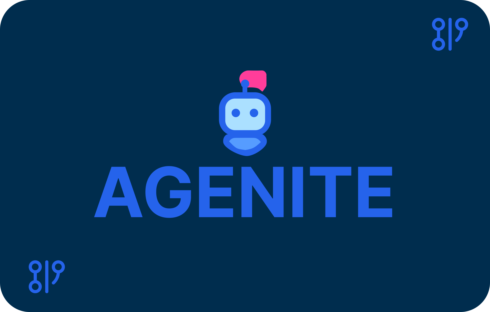

# 🤖 Agenite

<div align="center">
  
  <p><strong>A modern, modular, and type-safe framework for building AI agents using typescript</strong></p>
</div>

<div align="center">
  
[](https://github.com/subeshb1/agenite/blob/main/LICENSE)
[](https://www.npmjs.com/package/@agenite/agent)
[](https://www.typescriptlang.org/)
[](https://github.com/subeshb1/agenite/pulls)

</div>

## What is Agenite?

Agenite is a powerful TypeScript framework designed for building sophisticated AI agents. It provides a modular, type-safe, and flexible architecture that makes it easy to create, compose, and control AI agents with advanced capabilities.

## ✨ Key features

- **Type safety and developer experience**
  - Built from the ground up with TypeScript
  - Robust type checking for tools and agent configurations
  - Excellent IDE support and autocompletion

- **Tool integration**
  - First-class support for function calling
  - Built-in JSON Schema validation
  - Structured error handling
  - Easy API integration

- **Provider agnostic**
  - Support for OpenAI, Anthropic, AWS Bedrock, and Ollama
  - Consistent interface across providers
  - Easy extension for new providers

- **Advanced architecture**
  - Bidirectional flow using JavaScript generators
  - Step-based execution model
  - Built-in state management with reducers
  - Flexible middleware system

- **Model context protocol (MCP)**
  - Standardized protocol for connecting LLMs to data sources
  - Client implementation for interacting with MCP servers
  - Access to web content, filesystem, databases, and more

## 📦 Available packages

| Package | Description | Installation |
|---------|-------------|--------------|
| **Core packages** | | |
| `@agenite/agent` | Core agent orchestration framework for managing LLM interactions, tool execution, and state management | `npm install @agenite/agent` |
| `@agenite/tool` | Tool definition framework with type safety, schema validation, and error handling | `npm install @agenite/tool` |
| `@agenite/llm` | Base provider interface layer that enables abstraction across different LLM providers | `npm install @agenite/llm` |
| **Provider packages** | | |
| `@agenite/openai` | Integration with OpenAI's API for GPT models with function calling support | `npm install @agenite/openai` |
| `@agenite/anthropic` | Integration with Anthropic's API for Claude models | `npm install @agenite/anthropic` |
| `@agenite/bedrock` | AWS Bedrock integration supporting Claude and other models | `npm install @agenite/bedrock` |
| `@agenite/ollama` | Integration with Ollama for running models locally | `npm install @agenite/ollama` |
| **MCP package** | | |
| `@agenite/mcp` | Model Context Protocol client for connecting to standardized data sources and tools | `npm install @agenite/mcp` |
| **Middleware packages** | | |
| `@agenite/pretty-logger` | Colorful console logging middleware for debugging agent execution | `npm install @agenite/pretty-logger` |

For a typical setup, you'll need the core packages and at least one provider:

```bash
# Install core packages
npm install @agenite/agent @agenite/tool @agenite/llm

# Install your preferred provider
npm install @agenite/openai
# OR
npm install @agenite/bedrock
```

## 🚀 Quick start

```typescript
import { Agent } from '@agenite/agent';
import { Tool } from '@agenite/tool';
import { BedrockProvider } from '@agenite/bedrock';
import { prettyLogger } from '@agenite/pretty-logger';

// Create a calculator tool
const calculatorTool = new Tool<{ expression: string }>({
  name: 'calculator',
  description: 'Perform basic math operations',
  inputSchema: {
    type: 'object',
    properties: {
      expression: { type: 'string' },
    },
    required: ['expression'],
  },
  execute: async ({ input }) => {
    try {
      const result = new Function('return ' + input.expression)();
      return { isError: false, data: result.toString() };
    } catch (error) {
      if (error instanceof Error) {
        return { isError: true, data: error.message };
      }
      return { isError: true, data: 'Unknown error' };
    }
  },
});

// Create an agent
const agent = new Agent({
  name: 'math-buddy',
  provider: new BedrockProvider({
    model: 'anthropic.claude-3-5-sonnet-20240620-v1:0',
  }),
  tools: [calculatorTool],
  instructions: 'You are a helpful math assistant.',
  middlewares: [prettyLogger()],
});

// Example usage
const result = await agent.execute({
  messages: [
    {
      role: 'user',
      content: [{ type: 'text', text: 'What is 1234 * 5678?' }],
    },
  ],
});
```

## 🏗️ Core concepts

### Agents

Agents are the central building blocks in Agenite. An agent:
- Orchestrates interactions between LLMs and tools
- Manages conversation state and context
- Handles tool execution and results
- Supports nested execution for complex workflows
- Provides streaming capabilities for real-time interactions

### Tools

Tools extend agent capabilities by providing specific functionalities:
- Strong type safety with TypeScript
- JSON Schema validation for inputs
- Flexible error handling
- Easy API integration

### Providers

Currently supported LLM providers:
- OpenAI API (GPT models)
- Anthropic API (Claude models)
- AWS Bedrock (Claude, Titan models)
- Local models via Ollama

### Model Context Protocol (MCP)

MCP is a standardized protocol for connecting LLMs to data sources:
- Client implementation for interacting with MCP servers
- Access to web content, filesystem, databases, and more
- Similar to how USB-C provides universal hardware connections

## 🔄 Advanced features

### Multi-agent systems

```typescript
// Create specialist agents
const calculatorAgent = new Agent({
  name: 'calculator-specialist',
  provider,
  tools: [calculatorTool],
  description: 'Specializes in mathematical calculations',
});

const weatherAgent = new Agent({
  name: 'weather-specialist',
  provider,
  tools: [weatherTool],
  description: 'Provides weather information',
});

// Create a coordinator agent
const coordinatorAgent = new Agent({
  name: 'coordinator',
  provider,
  agents: [calculatorAgent, weatherAgent],
  instructions: 'Coordinate between specialist agents to solve complex problems.',
});
```

### Step-based execution

```typescript
// Create an iterator for fine-grained control
const iterator = agent.iterate({
  messages: [{ role: 'user', content: [{ type: 'text', text: 'Calculate 25 divided by 5, then multiply by 3' }] }],
  stream: true,
});

// Process the stream with custom handling
for await (const chunk of iterator) {
  switch (chunk.type) {
    case 'agenite.llm-call.streaming':
      console.log(chunk.content);
      break;
    case 'agenite.tool-call.params':
      console.log('Using tool:', chunk.toolUseBlocks);
      break;
    case 'agenite.tool-result':
      console.log('Tool result:', chunk.result);
      break;
  }
}
```

## 📚 Documentation

For comprehensive documentation, visit [docs.agenite.com](https://docs.agenite.com):

- [Introduction](https://docs.agenite.com/introduction)
- [Quick start guide](https://docs.agenite.com/quickstart)
- [Core concepts](https://docs.agenite.com/core-concepts/overview)
- [Examples](https://docs.agenite.com/examples)
- [API reference](https://docs.agenite.com/api-reference/agent)

## 🤝 Community

- [GitHub Discussions](https://github.com/subeshb1/agenite/discussions)
- [Discord Community](https://discord.gg/v3TXcD6tUH)

## 🛠️ Development

```bash
git clone https://github.com/subeshb1/agenite.git
cd agenite
pnpm install
pnpm build
```

## 📄 License

MIT

## 🌟 Star history

[](https://star-history.com/#subeshb1/agenite&Date)

```

```
