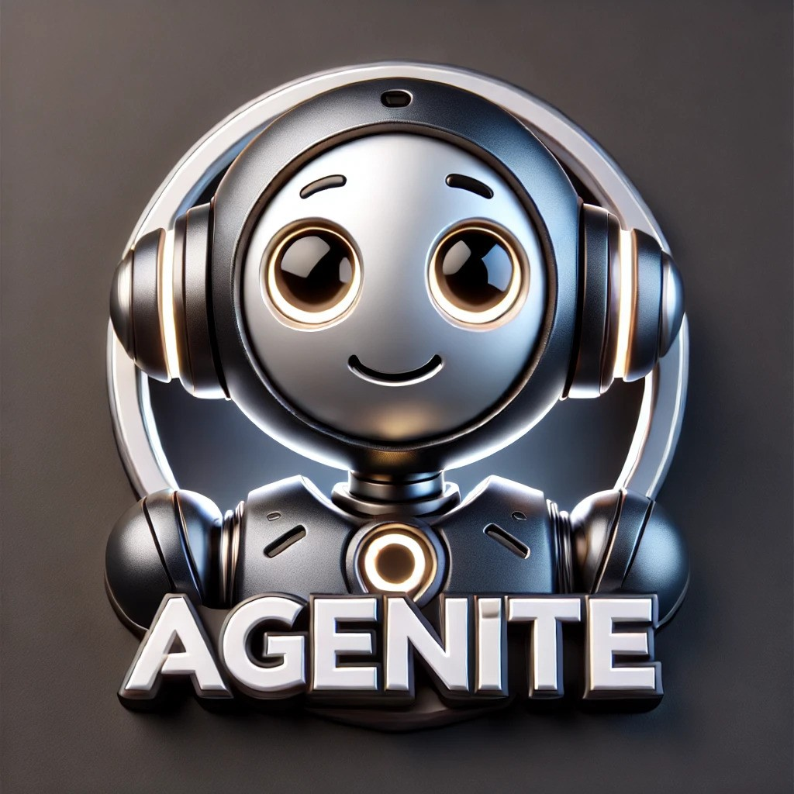

<div align="center">
  
  <h1>🤖 Agenite</h1>
  
  <p><strong>A modern, modular, and type-safe framework for building AI agents using typescript</strong></p>
 
</div>

<div align="center">
  
[](https://github.com/subeshb1/agenite/blob/main/LICENSE)
[](https://www.npmjs.com/package/@agenite/agent)
[](https://www.typescriptlang.org/)
[](https://github.com/subeshb1/agenite/pulls)

</div>

## ✨ Features

- 🎯 **Provider Agnostic** - Support for multiple LLM providers (OpenAI, Anthropic, AWS Bedrock, Ollama)
- 🔌 **Modular Architecture** - Plug-and-play components with clean interfaces
- 🛠️ **Tool Integration** - First-class support for function calling and tool usage
- 🤝 **Multi-Agent Systems** - Build complex agent hierarchies with delegation
- 🔒 **Type Safety** - Full TypeScript support with strong typing
- 🌊 **Streaming Support** - Real-time streaming responses across all providers
- 🎨 **Flexible Design** - IoC (Inversion of Control) for maximum extensibility
- 📦 **Zero Lock-in** - Easy to switch between providers or use multiple providers

## 📦 Installation

```bash
# Install core packages
npm install @agenite/agent @agenite/llm @agenite/tool

# Install your preferred provider(s)
npm install @agenite/openai    # For OpenAI
npm install @agenite/anthropic # For Anthropic/Claude
npm install @agenite/bedrock   # For AWS Bedrock
npm install @agenite/ollama    # For Ollama
```

## 🚀 Quick Start

```typescript
import { Agent } from '@agenite/agent';
import { OpenAIProvider } from '@agenite/openai';
import { Tool } from '@agenite/tool';

// Create a simple calculator tool
const calculatorTool = new Tool({
  name: 'calculator',
  description: 'Perform basic math operations',
  execute: async ({ input }) => {
    // Tool implementation
    return { success: true, data: result.toString() };
  },
});

// Initialize the agent
const agent = new Agent({
  name: 'math-buddy',
  provider: new OpenAIProvider({ apiKey: 'your-api-key' }),
  tools: [calculatorTool],
  systemPrompt: 'You are a helpful math assistant.',
});

// Execute the agent
const result = await agent.execute({
  messages: 'What is 1234 * 5678?',
});
```

## 🏗️ Architecture

Agenite is built on three core packages:

### @agenite/agent

The main orchestrator that manages interactions between LLMs and tools. Supports:

- Message processing
- Tool execution
- Multi-agent composition
- State management

### @agenite/llm

The provider interface layer that enables provider agnosticism:

- Common message format
- Streaming support
- Tool integration
- Provider-specific optimizations

### @agenite/tool

The tool definition and execution framework:

- Type-safe tool definitions
- Schema validation
- Error handling
- API integration

## 🔌 Supported Providers

Agenite supports multiple LLM providers out of the box:

- **@agenite/openai** - OpenAI API integration
- **@agenite/anthropic** - Anthropic Claude integration
- **@agenite/bedrock** - AWS Bedrock integration
- **@agenite/ollama** - Local Ollama integration

## 🎯 Advanced Features

### Multi-Agent Systems

Build complex agent hierarchies with specialized agents:

```typescript
// Create specialist agents
const calculatorAgent = new Agent({
  name: 'calculator-specialist',
  provider,
  tools: [calculatorTool],
});

const weatherAgent = new Agent({
  name: 'weather-specialist',
  provider,
  tools: [weatherTool],
});

// Create a coordinator agent
const coordinatorAgent = new Agent({
  name: 'coordinator',
  provider,
  tools: [calculatorAgent, weatherAgent],
});
```

### Provider Agnostic Design

Easily switch between providers or use multiple providers:

```typescript
// Use OpenAI
const openaiAgent = new Agent({
  provider: new OpenAIProvider({ apiKey: 'openai-key' }),
});

// Use Claude
const claudeAgent = new Agent({
  provider: new AnthropicProvider({ apiKey: 'claude-key' }),
});

// Use Bedrock
const bedrockAgent = new Agent({
  provider: new BedrockProvider({
    region: 'us-west-2',
    model: 'anthropic.claude-v2',
  }),
});
```

### Tool Integration

Create powerful tools with type safety and schema validation:

```typescript
interface WeatherInput {
  city: string;
  units?: 'metric' | 'imperial';
}

const weatherTool = new Tool<WeatherInput>({
  name: 'weather',
  description: 'Get current weather for a city',
  inputSchema: {
    type: 'object',
    properties: {
      city: { type: 'string' },
      units: { type: 'string' },
    },
    required: ['city'],
  },
  execute: async ({ input }) => {
    // Tool implementation
    return { success: true, data: weatherData };
  },
});
```

### Inversion of Control

Take full control of the tool execution flow by injecting custom results:

```typescript
// Initialize agent with tools
const agent = new Agent({
  name: 'ioc-calculator',
  provider,
  tools: [calculatorTool],
  systemPrompt: 'You are a math assistant.',
});

// Create an iterator for fine-grained control
const iterator = agent.iterate({
  messages: 'Calculate 25 divided by 5, then multiply by 3',
});

// Process the stream with custom tool handling
for await (const chunk of iterator) {
  switch (chunk.type) {
    case 'toolUse':
      if (chunk.tools[0]?.tool) {
        // Inject custom tool result
        const mockResult = [
          {
            type: 'toolResult',
            toolUseId: chunk.tools[0].tool.id,
            toolName: chunk.tools[0].tool.name,
            content:
              chunk.tools[0].tool.input.operation === 'divide' ? '5' : '15',
          },
        ];

        // Pass result back to the agent
        await iterator.next(mockResult);
      }
      break;

    case 'streaming':
      if (chunk.response.type === 'text') {
        process.stdout.write(chunk.response.text);
      }
      break;
  }
}
```

This IoC pattern allows you to:

- Intercept tool calls
- Inject custom results
- Implement custom tool execution logic
- Handle external integrations
- Add middleware layers

## 📚 Examples

Check out our [examples](./examples) directory for more:

- Basic chat agents
- Multi-agent systems
- Tool integration
- Streaming responses
- Provider switching
- State management

## 🛠️ Development

### Prerequisites

- Node.js 18+
- pnpm (we use pnpm workspaces)
- TypeScript 5.x

### Project Structure

```bash
packages/
  ├── agent/        # Core agent package
  ├── llm/          # Provider interface layer
  ├── tool/         # Tool framework
  ├── provider/     # LLM providers
  │   ├── openai/
  │   ├── anthropic/
  │   ├── bedrock/
  │   └── ollama/
  └── examples/     # Example implementations
```

### Setup Development Environment

1. Clone the repository:

```bash
git clone https://github.com/subeshb1/agenite.git
cd agenite
```

2. Install dependencies:

```bash
pnpm install
```

3. Build all packages:

```bash
pnpm build
```

4. Run tests:

```bash
pnpm test
```

### Development Workflow

1. Create a new branch:

```bash
git checkout -b feature/your-feature-name
```

2. Start development server:

```bash
pnpm dev
```

3. Make your changes and ensure:

   - All tests pass: `pnpm test`
   - Linting passes: `pnpm lint`
   - Types check: `pnpm check-types`

4. Commit using conventional commits:

```bash
git commit -m "feat: add new feature"
git commit -m "fix: resolve issue"
git commit -m "docs: update documentation"
```

### Using Changesets

We use [Changesets](https://github.com/changesets/changesets) to manage versions and changelogs. Here's how to use it:

1. After making your changes, create a changeset:

```bash
pnpm changeset
```

2. Select the packages you've modified:

```bash
🦋  Which packages would you like to include? ...
✔  @agenite/agent
✔  @agenite/tool
```

3. Choose the semver bump type:

```bash
🦋  Which type of change is this for @agenite/agent? ...
✔  patch
✔  minor
✔  major
```

4. Write a summary of changes when prompted:

```bash
🦋  What changes should go in the changelog?
🦋  Add your changes here
```

This will create a `.changeset` directory with a Markdown file containing your changes:

```markdown
---
'@agenite/agent': minor
'@agenite/tool': patch
---

Added new streaming capability to agent and fixed tool validation
```

5. Commit the changeset file:

```bash
git add .changeset/*.md
git commit -m "chore: add changeset for streaming feature"
```

When your PR is merged, our GitHub Actions will:

1. Collect all changesets
2. Update versions
3. Generate changelogs
4. Create a release PR
5. Publish to npm when the release PR is merged

## 🤝 Contributing

We love your input! We want to make contributing to Agenite as easy and transparent as possible.

### Types of Contributions

1. **Bug Reports**: Create an issue with the bug template
2. **Feature Requests**: Use the feature request template
3. **Code Contributions**: Submit a PR for:
   - Bug fixes
   - New features
   - Documentation improvements
   - Additional examples

### Contribution Guidelines

1. **Fork & Create Branch**

   - Fork the repo
   - Create a branch: `feature/amazing-feature`

2. **Make Changes**

   - Write clear, documented code
   - Add tests for new features
   - Update documentation as needed

3. **Commit Changes**

   - Use conventional commits
   - Keep commits focused and atomic
   - Reference issues in commit messages

4. **Submit PR**
   - Fill out the PR template
   - Link related issues
   - Request review from maintainers

### Code Style

- Follow TypeScript best practices
- Use ESLint and Prettier configurations
- Write clear comments and documentation
- Maintain test coverage

### Documentation

- Update relevant README files
- Add JSDoc comments to public APIs
- Include examples for new features
- Update API documentation

### Release Process

1. Main branch is always deployable
2. Releases follow semantic versioning
3. Changesets for version management
4. Automated releases via GitHub Actions

### Getting Help

- Ask in GitHub Discussions
- Reach out to maintainers

## 📄 License

MIT

## 🌟 Star History

[](https://star-history.com/#subeshb1/agenite&Date)

```

```
