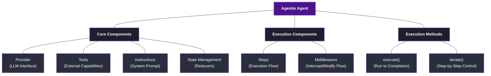
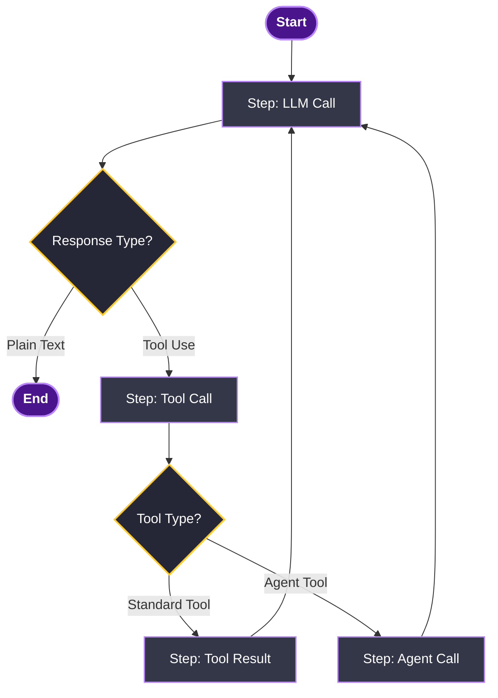
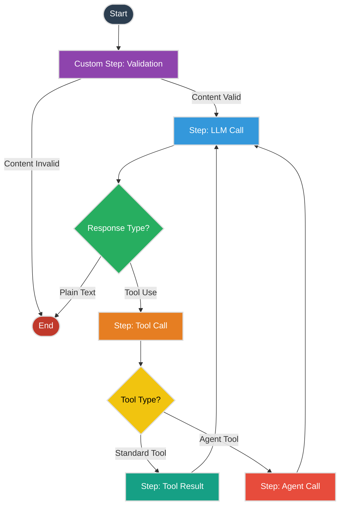
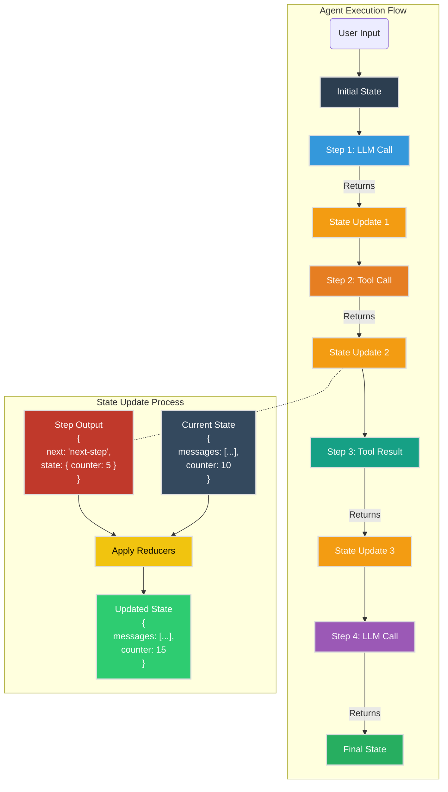
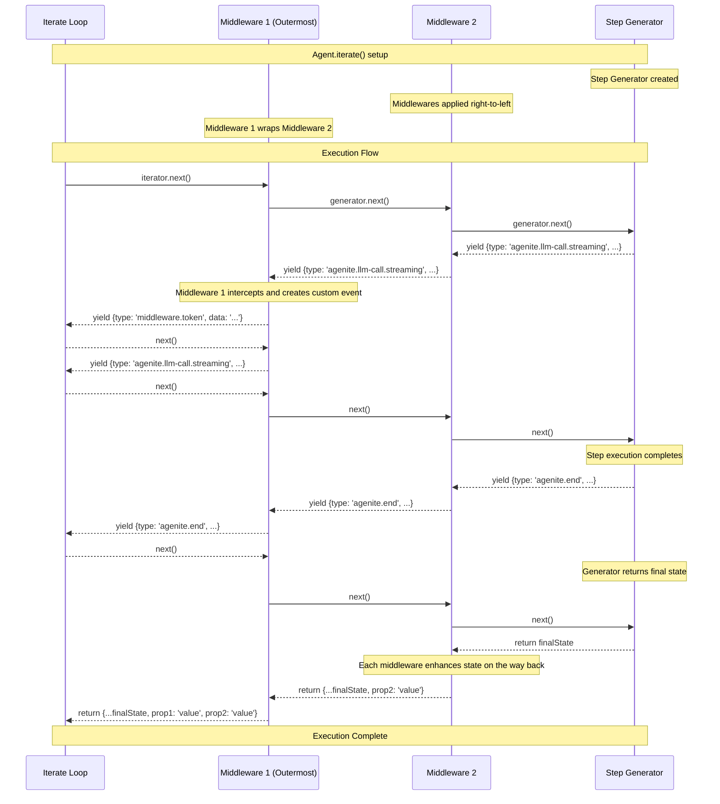
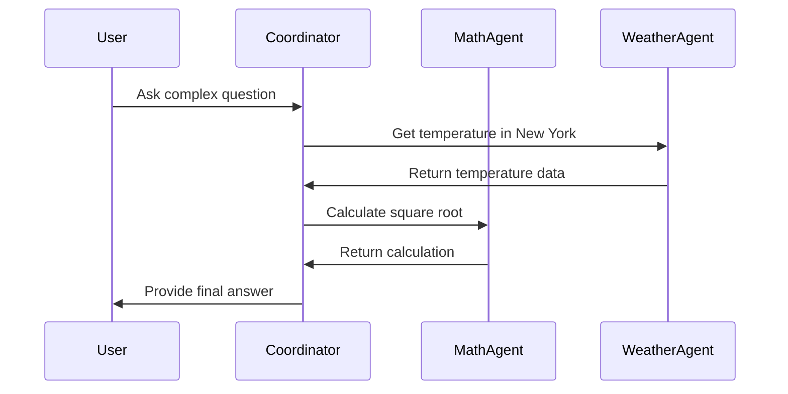

# What is an Agent?

An **agent** in AI systems is an autonomous entity that can perceive its environment, make decisions, and take actions to achieve specific goals. In the context of Agenite, an agent combines the reasoning capabilities of Large Language Models (LLMs) with the ability to use tools and interact with its environment.

Think of an agent as an AI assistant that can not only understand and generate text but also perform actions in the real world through its available tools – like searching the web, querying databases, making calculations, or even calling other specialized agents.

<Callout type="info">
  **Key Aspects of an Agent**
  
  * **Autonomous Decision-Making**: Agents use LLMs to reason about tasks and decide what actions to take
  * **Tool Usage**: Agents can extend their capabilities by using tools to interact with external systems
  * **Memory & State**: Agents maintain context through state management
  * **Sequential Processing**: Agents follow well-defined execution steps
  * **Composability**: Agents can work together in hierarchical structures
</Callout>

### Example: A Research Assistant Agent

To make this concrete, imagine a research assistant agent:

1. A user asks, "What were the major tech announcements from Google I/O 2023?"
2. The agent (powered by an LLM) understands this is a factual query that requires up-to-date information
3. It decides to use its web search tool to find recent articles
4. The agent receives search results and analyzes them
5. It might use additional tools to gather more details or verify information
6. Finally, it synthesizes a comprehensive answer from all collected data

This illustrates the agent's ability to:
- Understand natural language requests
- Choose appropriate tools based on the task
- Process and integrate information from multiple sources
- Deliver a coherent response that meets the user's need

## Agenite Agents

In Agenite, an **Agent** is the central orchestrator that manages interactions between language models (LLMs), tools, and possibly other agents. It implements a step-based execution model with state management and extensibility through middlewares.


## Basic Structure

An agent consists of:

**Core Components:**
- An LLM **Provider** (like OpenAI, Anthropic, etc.) that handles model interactions
- A collection of **Tools** the agent can use to perform tasks
- A system **instructions** string that guides the agent's behavior
- A state management system using **reducers**

**Execution Components:**
- A sequence of **Steps** that determine the execution flow
- Optional **Middlewares** that can intercept and modify the execution flow
- Methods for running the agent: `iterate()` and `execute()`



## Creating an Agent

```typescript
import { Agent } from '@agenite/agent';
import { OpenAI } from '@agenite/provider-openai';
import { Calculator } from '@agenite/tool';

// Basic agent construction
const agent = new Agent({
  name: 'calculator-agent',
  provider: new OpenAI(),
  tools: [new Calculator()],
  instructions: 'You are a helpful math assistant. Use the calculator tool when needed.',
});
```

### Important Agent Configuration Properties

The `Agent` constructor accepts a configuration object with these key properties:

| Property | Type | Description | Required |
|----------|------|-------------|----------|
| `name` | `string` | Identifies the agent; crucial for multi-agent setups | ✅ |
| `provider` | `LLMProvider` | The LLM provider that powers the agent | ✅ |
| `instructions` | `string` | System prompt given to the LLM to guide behavior | ✅ |
| `tools` | `Tool[]` | Tools the agent can use to accomplish tasks | Optional |
| `agents` | `Agent[]` | Sub-agents this agent can delegate to | Optional |
| `stateReducer` | `StateReducer` | Functions that control state updates | Optional |
| `initialState` | `Object` | Starting state values | Optional |
| `steps` | `Record<string, Step>` | Custom steps for execution flow | Optional |
| `startStep` | `string` | Which step to begin with (default: 'agenite.llm-call') | Optional |
| `middlewares` | `Middleware[]` | Functions that intercept execution | Optional |
| `description` | `string` | Used when this agent is called by others | Optional |

## Running an Agent

Agenite provides two methods to run agents:

### 1. `execute()` - Simple Run

The simplest way to run an agent to completion:

```typescript
// Run to completion and get the final result
const result = await agent.execute({
  messages: [{ role: 'user', content: 'What is 42 * 1234?' }]
});

// The result contains the final state with all messages and token usage
console.log(result.messages[result.messages.length - 1].content); // Final answer
console.log(result.tokenUsage); // Token usage statistics
```

### 2. `iterate()` - Step-by-Step Control

For fine-grained control over execution, use `iterate()` to access the underlying generator:

```typescript
// Get a generator for step-by-step control
const generator = agent.iterate({
  messages: [{ role: 'user', content: 'What is 42 * 1234?' }]
});

// Process events with a while loop (recommended pattern)
let response = await generator.next();

while (!response.done) {
  const event = response.value;
  
  // Handle different event types
  switch (event.type) {
    case 'agenite.llm-call.streaming':
      // Handle streaming chunks from the LLM
      process.stdout.write(event.content.chunk || '');
      break;
      
    case 'agenite.tool-call.params':
      // Execute tools when the agent requests them
      const toolResults = await executeTools(event.toolUseBlocks);
      // Pass results back to the agent
      response = await generator.next({ toolResultBlocks: toolResults });
      // Continue to next iteration since we've already called next()
      continue;
      
    case 'agenite.start':
      console.log('Agent execution started');
      break;
      
    case 'agenite.end':
      console.log('Agent execution completed');
      break;
      
    default:
      console.log(`Event: ${event.type}`);
  }
  
  // Move to next step (if we haven't already in a special case)
  response = await generator.next();
}

// When done is true, response.value contains the final state
console.log('Final result:', response.value);

// Helper function to execute tools
async function executeTools(toolUseBlocks) {
  return await Promise.all(toolUseBlocks.map(async (block) => {
    // Call the actual tool implementation
    const result = await myToolImplementation(block.name, block.input);
    
    return {
      toolUseBlock: block,
      result: {
        data: result,
        isError: false
      }
    };
  }));
}
```

The while loop pattern is crucial when using `iterate()` because:

1. It properly handles the generator protocol, advancing through steps with `next()`
2. It allows you to send data back into the generator (like tool results)
3. It cleanly handles the termination condition when `done` becomes true

Common use cases for `iterate()` include:
- Building interactive UIs that show real-time LLM responses
- Custom tool execution logic that might involve user input
- Advanced logging and monitoring
- Human-in-the-loop workflows where users can intervene

## Steps: The Agent Execution Flow

Agents in Agenite operate through a sequence of well-defined **Steps**. Each step is a discrete piece of functionality that yields control at key points.

### Core Steps

Agenite provides these built-in steps:

1. **LLM Call** (`agenite.llm-call`) 
   - Sends messages to the LLM provider
   - Handles streaming responses
   - Determines whether to proceed to tool calling or end

2. **Tool Call** (`agenite.tool-call`)
   - Processes tool use requests from the LLM
   - Yields control to let the application execute tools
   - Routes to either Tool Result or Agent Call based on tool type

3. **Tool Result** (`agenite.tool-result`) 
   - Executes standard tools (like calculators, APIs)
   - Processes tool results
   - Prepares results to send back to the LLM

4. **Agent Call** (`agenite.agent-call`)
   - Handles delegation to sub-agents
   - Manages nested execution
   - Returns sub-agent results back to the main agent

5. **End** (`agenite.end`) 
   - Terminates the execution flow
   - Returns the final state

### Step Flow Visualization


### Step Implementation

Each step in Agenite has a standard structure:

```typescript
// Simplified example of a step
const myCustomStep = {
  name: 'custom.my-step',
  
  // Run before the main execute function
  beforeExecute: async (context) => {
    // Process inputs, prepare parameters
    return { processedParams };
  },
  
  // Main execution generator function that can yield
  execute: async function* (params, context) {
    // Yield control at important points
    const externalInput = yield { 
      type: 'custom.my-step.needs-input',
      // other data
    };
    
    // Process and return result
    return {
      next: 'agenite.next-step-name', // Which step to go to next
      state: { /* state updates */ },
    };
  },
  
  // Run after execute completes
  afterExecute: async (result, context) => {
    // Clean up, finalize
    return result;
  }
};
```

### Customizing the step flow

Agenite provides the basic agent execution flow that covers perception (understanding the environment through LLM calls) and action (executing tools). However, sometimes you might want a different execution flow for specific use cases. You can customize this by defining your own steps or modifying existing ones.

To customize steps:

```typescript
import { Agent, LLMStep } from '@agenite/agent';

// Create an agent with a modified LLM step
const agent = new Agent({
  name: 'custom-flow-agent',
  provider: new OpenAI(),
  tools: [myCustomTool],
  instructions: 'You are a helpful assistant.',
  
  // Custom step configuration
  steps: {
    // Replace the built-in LLM call step with a modified version
    'agenite.llm-call': {
      ...LLMStep, // Extend the default LLM step
      
      // Add custom after-execution logic
      afterExecute: async (params) => {
        // Add a custom state value after each LLM call
        return {
          state: { 
            ...params.state, 
            lastLLMCallTimestamp: Date.now(),
            callCount: (params.state.callCount || 0) + 1
          },
          next: params.next, // Keep the original next step
        };
      },
    },
    
    // Add a completely custom step
    'custom.log-step': {
      name: 'custom.log-step',
      
      // Prepare parameters before execution
      beforeExecute: async (context) => {
        return { 
          message: `Processing user query: ${context.state.messages[0]?.content}` 
        };
      },
      
      // The main execute function as a generator
      execute: async function* (params) {
        // Log message to console
        console.log(params.message);
        
        // You can yield events that the iterate() loop can handle
        yield {
          type: 'custom.log-step.info',
          content: {
            message: params.message
          }
        };
        
        // Return the next step and any state changes
        return {
          next: 'agenite.llm-call', // Go to LLM call step next
          state: {
            debugMode: true
          }
        };
      },
      
      // Process the result after execution
      afterExecute: async (result) => {
        return result;
      }
    }
  },
  
  // Configure which step to start with
  startStep: 'custom.log-step' // Start with our custom step instead of LLM call
});
```

#### When to customize steps

Consider customizing steps when you need to:

1. **Add specialized processing**: For example, adding validation, preprocessing, or analysis before/after LLM calls
2. **Create complex workflows**: Building multi-stage agent interactions with specific logic between steps
3. **Implement custom state transitions**: Controlling exactly when and how an agent moves between different execution phases
4. **Add monitoring or debugging**: Injecting custom logging or instrumentation at specific points in execution

#### Step execution flow

When an agent runs, it follows these general steps:

1. Start at the configured `startStep` (default: 'agenite.llm-call')
2. For each step:
   - Run `beforeExecute()` to prepare parameters
   - Run `execute()` which can yield values back to the caller
   - Run `afterExecute()` to process the result
3. Use the `next` property from the step's return value to determine the next step
4. Continue until reaching 'agenite.end' or an error occurs

This execution model gives you fine-grained control over the agent's behavior while maintaining a clean, predictable flow.

#### Example: creating a content validation step

Here's a practical example of creating a validation step that checks user input before sending it to the LLM:

```typescript
import { Agent, LLMStep } from '@agenite/agent';
import { OpenAI } from '@agenite/provider-openai';
import { BaseReturnValues } from '@agenite/agent';

// Custom step that validates user input
const contentValidationStep = {
  name: 'custom.validation',
  
  // Prepare parameters before execution
  beforeExecute: async (context) => {
    const userMessage = context.state.messages.find(m => m.role === 'user');
    const userContent = typeof userMessage?.content === 'string' 
      ? userMessage?.content 
      : userMessage?.content?.[0]?.text || '';
      
    return { 
      userContent,
      // Define rules to check
      rules: [
        { type: 'profanity', keywords: ['badword1', 'badword2'] },
        { type: 'pii', pattern: /\b\d{3}-\d{2}-\d{4}\b/ } // SSN pattern
      ]
    };
  },
  
  // Main execution function
  execute: async function* (params, context) {
    // Check for rule violations
    const violations = [];
    
    for (const rule of params.rules) {
      if (rule.type === 'profanity') {
        for (const keyword of rule.keywords) {
          if (params.userContent.toLowerCase().includes(keyword.toLowerCase())) {
            violations.push(`Contains prohibited language: ${keyword}`);
          }
        }
      }
      else if (rule.type === 'pii') {
        if (rule.pattern.test(params.userContent)) {
          violations.push(`Contains sensitive personal information`);
        }
      }
    }
    
    // Report any violations we found
    if (violations.length > 0) {
      yield {
        type: 'custom.validation.violation',
        content: {
          violations
        }
      };
      
      // Return violation response and end execution
      return {
        next: 'agenite.end',
        state: {
          messages: [
            ...context.state.messages,
            {
              role: 'assistant',
              content: `I'm sorry, I cannot process this request due to content policy violations: ${violations.join(', ')}`
            }
          ]
        }
      };
    }
    
    // If everything is valid, proceed to LLM call
    return {
      next: 'agenite.llm-call',
      state: {} // No state changes
    };
  },
  
  // Process the result
  afterExecute: async (result) => {
    return result;
  }
};

// Create agent with the validation step
const agent = new Agent({
  name: 'validated-agent',
  provider: new OpenAI(),
  instructions: 'You are a helpful assistant.',
  steps: {
    'custom.validation': contentValidationStep,
    // Keep the default LLM step
    'agenite.llm-call': LLMStep
  },
  // Start with validation step instead of LLM call
  startStep: 'custom.validation'
});

// When using iterate(), handle the validation events
const generator = agent.iterate({
  messages: [{ 
    role: 'user', 
    content: 'Hi, my SSN is 123-45-6789, can you help me?' 
  }]
});

let result = await generator.next();
while (!result.done) {
  switch (result.value.type) {
    case 'custom.validation.violation':
      console.log('Content violation detected:', result.value.content.violations);
      break;
    
    // Handle other event types as usual
    case 'agenite.llm-call.streaming':
      process.stdout.write(result.value.content.chunk || '');
      break;
      
    // ...other cases
  }
  result = await generator.next();
}

console.log('Final response:', result.value.messages[result.value.messages.length - 1].content);
```

This example shows how to:
- Create a custom validation step before the LLM call
- Check user input against content policy rules
- Either block the request or allow it to proceed to the LLM
- Handle custom events in the `iterate()` loop

#### Visualizing a custom step flow

Here's how the validation step changes the default flow:



By adding custom steps, you can create more sophisticated agent behavior that better fits your specific use case.


## State Management

Agents maintain state throughout their execution. The primary state is the message history, but you can add custom state fields with reducers:

```typescript
// Add custom state with a reducer
const agent = new Agent({
  // ... other config
  stateReducer: {
    // Default messages reducer
    messages: (newValue, previousValue) => [...(previousValue || []), ...(newValue || [])],
    
    // Custom state fields
    counter: (newValue, previousValue) => (previousValue || 0) + (newValue || 0),
    userData: (newValue, previousValue) => ({ ...(previousValue || {}), ...(newValue || {}) }),
  },
  initialState: {
    counter: 0,
    userData: { name: 'Alice' },
  },
});
```

The reducer pattern allows you to control how new state is merged with existing state during execution.

### State Flow Visualization



As an agent executes, each step produces state changes that are processed through reducers:

1. **Step Execution**: Each step (LLM Call, Tool Call, etc.) runs and returns an object:
   ```typescript
   {
     next: 'name-of-next-step', // Which step to run next
     state: { /* changes to apply */ } // State updates
   }
   ```

2. **State Processing**: For each field in the returned state object:
   - Find the matching reducer function
   - Apply the reducer to merge new values with existing state
   - Create an updated state that includes these changes

3. **Execution Flow**: Move to the next step specified in the `next` field, using the updated state

This cycle repeats for each step in the agent's execution, creating a chain where each step builds on the state from previous steps.

### Example

When a step returns:
```typescript
return {
  next: 'agenite.tool-call',
  state: {
    messages: [{ role: 'assistant', content: 'I need to calculate something' }],
    counter: 5,
  }
};
```

And the current state is:
```typescript
{
  messages: [{ role: 'user', content: 'What is 10 + 5?' }],
  counter: 10
}
```

The updated state becomes:
```typescript
{
  messages: [
    { role: 'user', content: 'What is 10 + 5?' },
    { role: 'assistant', content: 'I need to calculate something' }
  ],
  counter: 15 // 10 + 5 = 15
}
```

Then, execution continues with the `agenite.tool-call` step.

### The State as Agent Output

An important aspect of Agenite's state management is that **the final state becomes the agent's output**. When an agent completes execution (reaching the `agenite.end` step), the accumulated state is returned as the result:

```typescript
// When agent.execute() completes, it returns the final state:
const result = await agent.execute({ 
  messages: [{ role: 'user', content: 'What is 2+2?' }] 
});

// The result IS the final state, including all accumulated messages
console.log(result.messages); // All messages including the final LLM response
```

This means that by defining custom state reducers, you're not just controlling how state evolves during execution—you're also shaping the exact structure of the agent's output. You can:

- Track custom metrics throughout execution
- Accumulate data across multiple steps
- Transform or filter certain types of information
- Define exactly what data your application receives when the agent finishes

For example, if you want your agent to track a conversation summary:

```typescript
const agent = new Agent({
  // ... other config
  stateReducer: {
    messages: defaultStateReducer.messages, // Keep default message handling
    
    // Add custom state field with custom reducer
    summary: (newSummary, previousSummary = '') => {
      // Append new summary information if provided
      if (newSummary) {
        return previousSummary + '\n' + newSummary;
      }
      return previousSummary;
    }
  },
  initialState: {
    summary: 'Conversation started.'
  }
});

// Later steps can update the summary
return {
  next: 'agenite.llm-call',
  state: {
    messages: [ /* ... */ ],
    summary: 'User asked about weather in Paris.'
  }
};

// When execution finishes:
const result = await agent.execute(input);
console.log(result.summary); // Access the accumulated summary
```

## Extending with Middlewares

Middlewares are powerful wrappers around the agent's execution generator that enable you to intercept, modify, or enhance the execution flow. They work by forming a chain that surrounds the main generator.

### How Middlewares Work

Each middleware is an async generator function that:
1. Receives the inner generator and context as parameters
2. Creates a loop to manage the generator's execution
3. Can intercept values as they are yielded out
4. Can modify values being sent back via `next()`
5. Returns the final value when execution completes

```typescript
// Middleware function signature
const myMiddleware = () => {
  return async function* (generator, context) {
    let nextValue;
    
    while (true) {
      // Get the next yielded value
      const { value, done } = await generator.next(nextValue);
      
      // If the generator is done, return the final value
      if (done) return value;
      
      // You can transform the value here before yielding it up
      const transformedValue = { ...value, extra: 'data' };
      
      // Yield the value up to the caller or next middleware
      // and receive what they pass back via next()
      nextValue = yield transformedValue;
      
      // You can transform what gets passed back to the generator
      nextValue = nextValue ? { ...nextValue, modified: true } : nextValue;
    }
  };
};
```

### Middleware Examples

#### 1. Logger Middleware

A simple logger that records all events and responses:

```typescript
const loggerMiddleware = (options = { verbose: false }) => {
  return async function* (generator, context) {
    let nextValue;
    const startTime = Date.now();
    
    console.log(`[AGENT] Started execution: ${context.agent.agentConfig.name}`);
    
    try {
      while (true) {
        const { value, done } = await generator.next(nextValue);
        
        if (done) {
          const duration = Date.now() - startTime;
          console.log(`[AGENT] Execution finished in ${duration}ms`);
          console.log(`[AGENT] Token usage: ${JSON.stringify(value.tokenUsage)}`);
          return value;
        }
        
        // Log the event
        if (options.verbose || value.type.includes('tool') || value.type === 'agenite.start' || value.type === 'agenite.end') {
          console.log(`[AGENT EVENT] ${value.type}`);
        }
        
        // Yield up the chain
        nextValue = yield value;
        
        // Log any incoming values
        if (nextValue && options.verbose) {
          console.log(`[AGENT RECEIVED] ${JSON.stringify(nextValue)}`);
        }
      }
    } catch (error) {
      console.error(`[AGENT ERROR] ${error.message}`);
      throw error;
    }
  };
};

// Usage
const agent = new Agent({
  name: 'verbose-agent',
  provider: new OpenAI(),
  middlewares: [loggerMiddleware({ verbose: true })],
  // ... other config
});
```

#### 2. Human-in-the-Loop (HITL) Middleware

Allows a human to review and approve agent actions before execution:

```typescript
const humanApprovalMiddleware = () => {
  // Simple prompt function that returns a Promise resolving to true/false
  function promptUser(question) {
    return new Promise((resolve) => {
      process.stdout.write(`${question} (y/n): `);
      
      const onData = (data) => {
        const answer = data.toString().trim().toLowerCase();
        process.stdin.removeListener('data', onData);
        resolve(answer === 'y' || answer === 'yes');
      };
      
      process.stdin.on('data', onData);
    });
  }
  
  return async function* (generator, context) {
    let nextValue;
    
    while (true) {
      const { value, done } = await generator.next(nextValue);
      
      if (done) return value;
      
      // Intercept tool calls for human approval
      if (value.type === 'agenite.tool-call.params') {
        console.log('\n🔧 Tool call requested:');
        value.toolUseBlocks.forEach(block => {
          console.log(`- ${block.name}: ${JSON.stringify(block.input)}`);
        });
        
        const shouldContinue = await promptUser('Allow this tool call?');
        
        if (!shouldContinue) {
          // User denied - send back error responses for all tools
          nextValue = {
            toolResultBlocks: value.toolUseBlocks.map(block => ({
              toolUseBlock: block,
              result: { 
                isError: true,
                data: 'User denied this tool call request'
              }
            }))
          };
          
          yield value;
          continue;
        }
        // If shouldContinue is true, we just fall through and yield normally
      }
      
      // For any other event types, just pass through
      nextValue = yield value;
    }
  };
};
```

This simple middleware integrates at the tool call level, allowing a human to approve or reject each tool call the agent tries to make. When a tool call is rejected, the agent receives an error response that it must handle appropriately.

### Combining Multiple Middlewares

Middlewares are applied in the order provided, with the first middleware in the array being the outermost wrapper:

```typescript
const agent = new Agent({
  name: 'enhanced-agent',
  provider: new OpenAI(),
  middlewares: [
    loggerMiddleware({ verbose: true }),  // Applied first
    humanApprovalMiddleware(),           // Applied second
  ],
  // ... other config
});
```

In this example:
1. The logger middleware sees all events first and logs them
2. Then the human approval middleware handles review requests
3. Finally, the agent's core generator processes them

The execution flow travels inward through all middlewares, then outward again as values are yielded back up the chain.

### Custom Events and Return Values

Middlewares can also yield custom events and modify the final return value, enabling powerful integration patterns:

```typescript
// Middleware that adds custom events and return values
const enhancedMiddleware = () => {
  return async function* (generator, context) {
    let nextValue;
    
    // Track token usage for custom metrics
    let tokenCount = 0;
    
    while (true) {
      const { value, done } = await generator.next(nextValue);
      
      if (done) {
        // Enhance the final return value with custom properties
        return { 
          ...value,           // Keep the original state
          from: 'middleware', // Add custom property
          a: 'custom value',  // Add another custom property
        };
      }
      
      // Track token usage from streaming events
      if (value.type === 'agenite.llm-call.streaming' && 
          value.content?.type === 'text') {
        tokenCount += value.content.text.split(/\s+/).length; // Simple approximation
        
        // Emit a custom event every 50 tokens
        if (tokenCount % 50 === 0) {
          // Yield a completely custom event type
          yield {
            type: 'middleware.token',
            b: `Processed approximately ${tokenCount} tokens`
          };
          // You must receive the next value after yielding
          nextValue = yield value;
          continue;
        }
      }
      
      // For other events, pass through
      nextValue = yield value;
    }
  };
};

// Using the middleware
const agent = new Agent({
  name: 'enhanced-agent',
  provider: new OllamaProvider({ model: 'llama3.2' }),
  middlewares: [enhancedMiddleware()],
  // ... other config
});

// In your iterate() handler, handle the custom events
const iterator = agent.iterate({
  messages: [userTextMessage('Tell me about AI agents')]
});

let result = await iterator.next();
while (!result.done) {
  switch (result.value.type) {
    case 'agenite.llm-call.streaming':
      // Handle normal streaming
      if (result.value.content.type === 'text') {
        process.stdout.write(result.value.content.text);
      }
      break;
      
    // Handle custom middleware event type
    case 'middleware.token':
      console.log('\n[Token Tracker]:', result.value.b);
      break;
      
    default:
      // Handle other event types
      break;
  }
  result = await iterator.next();
}

// Access custom return properties
console.log(result.value.from); // 'middleware'
console.log(result.value.a);    // 'custom value'
```

This example demonstrates two key capabilities:

1. **Custom Event Types**: The middleware yields events with custom `type` values like `middleware.token` and includes arbitrary data properties.

2. **Enhanced Return Values**: When the generator is `done`, the middleware enhances the final state with additional properties that the caller can access.

These capabilities allow middlewares to:

- Implement custom monitoring, logging, or metrics
- Add side channels for communication with the caller
- Embed metadata in the final result
- Create specialized UI events for front-end applications
- Build detailed analytics or debugging systems

By combining custom events and return values with the core middleware functionality, you can extend Agenite agents in virtually unlimited ways.

### Visualizing Middleware Flow with Custom Events



This diagram illustrates how Agenite's middleware system works, based on the actual implementation:

1. **Middleware Application**: When `agent.iterate()` is called, the step generator is created first, then middlewares are applied in right-to-left order using `reduceRight()`. This means the first middleware in the array wraps all others.

2. **Event Flow**: When steps execute inside the generator, events flow outward through the middleware chain:
   - Step Generator yields an event
   - Each middleware processes the event in sequence
   - The outermost middleware passes events to the iterate loop

3. **Custom Events**: Middlewares can intercept standard events and create custom events (like `middleware.token`) which the iterate loop handles.

4. **Return Enhancement**: When the step generator completes, the final state flows back through the middleware chain, allowing each middleware to enhance it before returning to the caller.

The bidirectional nature of this architecture enables powerful patterns:
- Middlewares can monitor and transform events
- Middlewares can add custom properties to the final state
- The iterate loop gets visibility into both standard and custom events
- Each middleware sees both the events flowing out and the results flowing back

By combining custom events and return values with this chained middleware pattern, you can build sophisticated monitoring, human-in-the-loop systems, and complex agent behaviors.


### Custom Middleware Tips

When creating custom middlewares:

1. **Error Handling**: Always include try/catch blocks to prevent errors from breaking the agent
2. **Types**: Consider what event types you need to handle - most middlewares only need to process specific events
3. **Performance**: Be mindful of performance, especially for events that occur frequently like streaming chunks
4. **Chaining**: Test your middleware with others to ensure they work well together
5. **State**: Avoid shared state between middleware instances unless explicitly designed for it

## Multi-Agent Architecture

Agents can be composed into hierarchies, with coordinator agents delegating to specialist agents:

```typescript
// Specialist agents
const mathAgent = new Agent({
  name: 'math-specialist',
  description: 'Expert at solving math problems',
  provider: new OpenAI(),
  tools: [calculatorTool],
  instructions: 'You are an expert math assistant.',
});

const weatherAgent = new Agent({
  name: 'weather-specialist',
  description: 'Expert at weather information',
  provider: new OpenAI(),
  tools: [weatherTool],
  instructions: 'You provide accurate weather information.',
});

// Coordinator agent that can delegate to specialists
const coordinatorAgent = new Agent({
  name: 'coordinator',
  provider: new OpenAI(),
  agents: [mathAgent, weatherAgent], // Sub-agents this agent can call
  instructions: 'You coordinate between specialist agents. For math questions, delegate to math-specialist. For weather questions, delegate to weather-specialist.',
});

// Run the coordinator
const result = await coordinatorAgent.execute({
  messages: [{ 
    role: 'user', 
    content: 'What is the square root of the current temperature in New York?' 
  }]
});
```

When the coordinator receives a question, it can choose to delegate to the appropriate specialist using the Agent Call step.

### Multi-Agent Flow



This architecture enables complex problem-solving through specialized agents working together.
