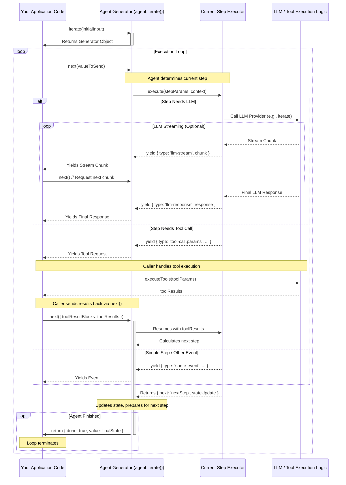

## Core Architecture: Generators and Bidirectional Flow

Agenite's core architecture is built upon modern JavaScript features, primarily **Async Generators**. This design choice enables a flexible, controllable, and efficient execution flow for AI agents, particularly well-suited for handling asynchronous operations, streaming data, and complex interactions like Human-in-the-Loop (HITL).

### JavaScript Async Generators: The Engine

At its heart, an Agenite agent's execution is managed by an Async Generator. When you call the `agent.iterate()` method, it doesn't run the whole process at once. Instead, it returns an `AsyncGenerator` object.

```typescript
import { Agent } from '@agenite/agent';
import { OpenAI } from '@agenite/provider-openai';

const agent = new Agent({ provider: new OpenAI() });

// Calling iterate returns the generator, but doesn't run it yet
const generator = agent.iterate({ messages: [{ role: 'user', content: 'Hello!' }] });
```

This generator represents the agent's step-by-step execution plan. Key points:

1.  **Pausable Execution:** Generators can be paused (`yield`) and resumed (`next()`). In Agenite, execution yields at meaningful points: before/during LLM calls, before/during tool calls, at the start/end of steps, or even while streaming responses. This pause allows other code to inspect state or intervene.
2.  **Step-based Progression:** Agenite agents operate in discrete `Steps` (like `agenite.llm-call`, `agenite.tool-call`). Each step's `execute` method is often an `AsyncGenerator` itself. The main agent generator uses `yield*` to delegate control to the current step's generator, effectively chaining these steps together.
3.  **Asynchronous Handling:** `AsyncGenerator`s seamlessly integrate asynchronous operations (like network requests to LLMs or tools) into the sequential flow of the agent.

### Bidirectional Data Flow: The Conversation

A crucial feature of generators is that `yield` isn't just a pause; it's a two-way street.

1.  **Agent Yields Information:** When the generator pauses (`yield`), it sends out a value (an object describing the current state or event, e.g., `{ type: 'agenite.llm-call.streaming', ... }`).
2.  **Caller Sends Information Back:** When the caller resumes the generator (`generator.next(value)`), it can pass a value *back* into the generator. The paused `yield` expression inside the generator then resolves to this incoming value.

```typescript
// Simple Generator Example
async function* interactiveCounter() {
  let count = 0;
  let increment = 1;
  while (true) {
    // Yield the current count and wait for a new increment value
    const newIncrement = yield `Count is ${count}. Send next increment?`;
    // If a value was sent back via .next(), update the increment
    if (typeof newIncrement === 'number') {
      increment = newIncrement;
      console.log(`Generator: Received new increment: ${increment}`);
    } else {
      console.log(`Generator: No new increment received, using ${increment}`);
    }
    count += increment;
  }
}

// Using the Generator
const gen = interactiveCounter();

(async () => {
  let result = await gen.next(); // Start it
  console.log(`Caller: ${result.value}`); // -> Caller: Count is 0. Send next increment?

  result = await gen.next(); // Resume without sending a value (newIncrement will be undefined)
  console.log(`Caller: ${result.value}`); // -> Caller: Count is 1. Send next increment?

  result = await gen.next(5); // Resume, sending 5 back to the generator
  console.log(`Caller: ${result.value}`); // -> Caller: Count is 6. Send next increment?

  result = await gen.next(10); // Resume, sending 10 back
  console.log(`Caller: ${result.value}`); // -> Caller: Count is 16. Send next increment?
})();
```

Agenite uses this bidirectional flow extensively:

*   **Observing State:** Yielded events (`{ type: '...', ... }`) let you monitor the agent's progress (e.g., "now calling LLM", "now streaming chunk").
*   **Providing Data:** Sending values back via `generator.next(value)` is essential for:
    *   **Tool Results:** Agent yields `{ type: 'agenite.tool-call.params', toolUseBlocks }`. Caller executes tools and sends results back via `.next({ toolResultBlocks: [...] })`.
    *   **Middleware:** Middlewares wrap the generator, intercepting `yield`s and controlling values passed via `next()`.
    *   **Human Input:** Pausing execution to wait for human feedback or decisions.

### Visualizing the Flow

The following sequence diagram illustrates the interaction between the calling code and the agent generator, focusing on the bidirectional communication:



This diagram shows:
*   The initial call to `iterate()`.
*   The main loop where the Caller calls `next()`.
*   How the Agent Generator delegates to Step Executors.
*   How `yield` passes information (events, stream chunks, tool requests) back to the Caller.
*   How the Caller uses `next(value)` to send information (like tool results) back into the Agent Generator.
*   Interaction with external systems like LLMs or tool execution logic.

### Example: Iterating Through Agent Execution

Here's a conceptual loop showing how you might handle different yielded events from `agent.iterate()`:

```typescript
async function runAgent(agent: Agent, initialInput: any) {
  const generator = agent.iterate(initialInput);
  let lastValue: any = undefined; // Value to send back via next()

  while (true) {
    const { value: yieldedEvent, done } = await generator.next(lastValue);

    if (done) {
      console.log('Agent finished. Final State:', yieldedEvent);
      // yieldedEvent here is the final return value (usually agent state)
      return yieldedEvent;
    }

    // Reset lastValue for the next iteration unless overridden below
    lastValue = undefined;

    // Log or react based on the type of event yielded
    console.log('Agent yielded:', yieldedEvent.type, yieldedEvent.content);

    switch (yieldedEvent.type) {
      case 'agenite.llm-call.streaming':
        // Just observing the stream
        process.stdout.write(yieldedEvent.content?.chunk || '');
        break;

      case 'agenite.tool-call.params':
        // Agent is requesting tool execution
        console.log(`Requesting tool calls:`, yieldedEvent.toolUseBlocks);
        const toolResults = await executeTools(yieldedEvent.toolUseBlocks); // Your function
        // Send results back to the agent
        lastValue = { toolResultBlocks: toolResults };
        break;

      // Add cases for other event types you care about...

      case 'agenite.start':
      case 'agenite.end':
      case 'agenite.llm-call.input':
        // Informational events, typically no input needed
        break;

      default:
        // Handle unknown or other event types
        console.log('Unhandled event type:', yieldedEvent.type);
    }
  }
}

// Placeholder for your tool execution logic
async function executeTools(toolUseBlocks: any[]): Promise<any[]> {
  // ... map toolUseBlocks to actual function calls ...
  // ... return results in the expected format ...
  return []; // Dummy implementation
}
```

### Human-in-the-Loop (HITL) Example

The generator architecture naturally supports HITL scenarios. You can pause the agent and wait for human input before proceeding.

Imagine you want the agent to propose an action (e.g., send an email) and wait for confirmation:

1.  **Custom Step:** Create a custom agent step (e.g., `custom.request-confirmation`) that simply `yield`s a specific event.
2.  **Iteration Loop:** Modify your iteration loop to recognize this event, prompt the human, and send the response back.

```typescript
// 1. Define a custom step (simplified)
const requestConfirmationStep: Step<any, any, any, any> = {
  name: 'custom.request-confirmation',
  // beforeExecute: ...,
  execute: async function* (params, context) {
    // Yield an event indicating confirmation is needed
    const humanResponse = yield {
      type: 'custom.needs-confirmation',
      message: params.messageToConfirm, // Message passed from previous step
    };

    // The value sent via .next(humanResponse) will arrive here
    if (humanResponse?.confirmed) {
      return { next: params.nextStepOnConfirm }; // Proceed
    } else {
      return { next: params.nextStepOnReject }; // Go elsewhere
    }
  },
  // afterExecute: ...,
};

// Assume agent is configured with this step in its flow

// 2. Update the iteration loop
async function runAgentWithHITL(agent: Agent, initialInput: any) {
  const generator = agent.iterate(initialInput);
  let lastValue: any = undefined;

  while (true) {
    const { value: yieldedEvent, done } = await generator.next(lastValue);

    if (done) { /* ... handle finish ... */ return yieldedEvent; }

    lastValue = undefined; // Reset

    console.log('Agent yielded:', yieldedEvent.type);

    switch (yieldedEvent.type) {
      // ... other cases like LLM streaming, tool calls ...

      case 'custom.needs-confirmation':
        console.log(`Confirmation Needed: ${yieldedEvent.message}`);
        // Use a library like 'inquirer' or simple readline for real apps
        const userConfirmed = await promptUserForConfirmation(yieldedEvent.message);
        // Send the confirmation result back to the agent
        lastValue = { confirmed: userConfirmed };
        break;

      default:
        // ...
    }
  }
}

// Placeholder for user interaction logic
async function promptUserForConfirmation(message: string): Promise<boolean> {
  // In a real app, use readline, inquirer, or a UI element
  const response = await new Promise<string>((resolve) => {
    const readline = require('readline').createInterface({
      input: process.stdin,
      output: process.stdout,
    });
    readline.question(`${message} (yes/no): `, (answer) => {
      readline.close();
      resolve(answer.toLowerCase());
    });
  });
  return response === 'yes';
}
```

This shows how the agent can pause its execution (`yield`), hand control back to your application code, wait for external input (from a human), and then resume (`next(humanResponse)`) based on that input.

### Benefits Revisited

This generator-based, bidirectional architecture provides:

*   **Fine-grained Control:** Pause, inspect, and inject data at any `yield` point.
*   **Clear Observability:** Yielded events offer a transparent view into the agent's execution state.
*   **Natural Streaming:** Async generators are ideal for handling data streams (like LLM responses).
*   **Seamless Extensibility:** Middlewares easily wrap and modify generator behavior. Build complex interaction patterns like HITL.
*   **Testability:** Individual steps and the overall flow can be tested by controlling the generator's iteration.
*   **Composability:** Flows like nested agent calls (`yield* agent.iterate(...)`) integrate naturally.

Understanding this architecture is key to unlocking Agenite's flexibility for building sophisticated, interactive, and observable AI agents.
