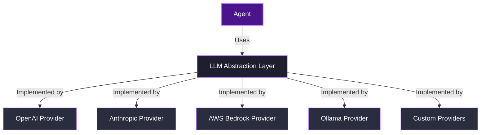

# What is the LLM component?

The **LLM** (Large Language Model) component in Agenite is the abstraction layer that provides a unified interface for communicating with different language models. It serves as the bridge between your agent logic and the underlying AI providers like OpenAI, Anthropic, AWS Bedrock, or Ollama.

This abstraction is crucial as it allows you to:
- Write provider-agnostic code that works across different LLM services
- Handle both streaming and non-streaming interactions consistently
- Work with rich content types beyond just text
- Manage tool usage through a standardized interface

<Callout type="info">
  **Key aspects of the LLM component**
  
  * **Abstraction layer**: Provides a uniform interface across different LLM providers
  * **Content handling**: Manages rich content like text, images, tool calls, and thinking blocks
  * **Message formatting**: Standardizes the format of messages between agents and LLMs
  * **Token tracking**: Facilitates monitoring token usage for performance and cost tracking
  * **Streaming support**: Enables real-time streaming of model outputs
</Callout>

## The LLM architecture

The LLM component sits between agents and providers, providing a clean abstraction that isolates agent logic from provider-specific implementation details.



### Core interfaces

The heart of the LLM component is the `LLMProvider` interface, which defines three essential methods:

```typescript
interface LLMProvider {
  name: string;
  version?: string;

  /**
   * Simple text generation with full response
   */
  generate(
    input: string | BaseMessage[],
    options?: Partial<GenerateOptions>
  ): Promise<GenerateResponse>;

  /**
   * Simple streaming with partial returns
   */
  stream(
    input: string | BaseMessage[],
    options?: Partial<GenerateOptions>
  ): AsyncGenerator<PartialReturn, GenerateResponse, unknown>;

  /**
   * Low-level generation API with full control
   */
  iterate(
    input: string | BaseMessage[],
    options: IterateGenerateOptions
  ): AsyncGenerator<PartialReturn, GenerateResponse, unknown>;
}
```

## Message structure

The LLM component standardizes messages using the `BaseMessage` interface:

```typescript
interface BaseMessage {
  role: 'user' | 'assistant' | 'system';
  content: ContentBlock[];
}
```

### Content blocks

Content blocks provide a flexible way to represent different types of content:

```typescript
type ContentBlock =
  | TextBlock        // Plain text
  | ImageBlock       // Images (base64 or URL)
  | ToolUseBlock     // Tool usage by the agent
  | ToolResultBlock  // Results from tool execution
  | DocumentBlock    // Document references
  | ThinkingBlock    // Agent reasoning/thinking
  | RedactedThinkingBlock; // Redacted agent reasoning
```

This rich structure allows agents to handle multimodal content and tool interactions in a consistent way.

## Working with the LLM component

### Basic text generation

The simplest way to use the LLM component is for basic text generation:

```typescript
import { BedrockProvider } from '@agenite/bedrock';

const provider = new BedrockProvider({ 
  model: 'anthropic.claude-3-5-sonnet-20240620-v1:0'
});

// Generate a response
const response = await provider.generate(
  'Explain the concept of abstraction in programming', 
  { 
    temperature: 0.7,
    maxTokens: 500
  }
);

console.log(response.content[0].text); // Access the response text
```

### Streaming responses

For real-time interactions, you can use the streaming interface:

```typescript
const generator = provider.stream(
  'Write a short poem about programming', 
  { temperature: 0.9 }
);

// Process streaming chunks
for await (const chunk of generator) {
  if (chunk.type === 'text') {
    process.stdout.write(chunk.text);
  }
}
```

### Working with tools

When working with tools, the LLM component provides structured handling:

```typescript
const response = await provider.generate(
  'What's the weather in New York and calculate 25 * 137?',
  {
    tools: [
      {
        name: 'weather',
        description: 'Get current weather for a city',
        inputSchema: {
          type: 'object',
          properties: {
            city: { type: 'string' }
          },
          required: ['city']
        }
      },
      {
        name: 'calculator',
        description: 'Perform calculations',
        inputSchema: {
          type: 'object',
          properties: {
            expression: { type: 'string' }
          },
          required: ['expression']
        }
      }
    ]
  }
);

// Check if the response includes tool use
const toolUseBlocks = response.content.filter(
  block => block.type === 'toolUse'
) as ToolUseBlock[];

if (toolUseBlocks.length > 0) {
  // Process tool usage...
}
```

## Integration with agents

The agent component uses the LLM component in the `LLMStep`, which handles:

1. Sending messages to the LLM provider
2. Processing streaming responses
3. Deciding whether to proceed to tool calling or end the conversation
4. Managing token usage tracking

The key aspect of this integration is that agents work with the abstract `LLMProvider` interface rather than specific provider implementations, allowing you to easily swap providers without changing your agent logic.

```typescript
import { Agent } from '@agenite/agent';
import { BedrockProvider } from '@agenite/bedrock';
import { Calculator } from '@agenite/tool';

// The agent uses the LLM provider, not directly working with OpenAI's API
const agent = new Agent({
  name: 'math-assistant',
  provider: new BedrockProvider({ model: 'anthropic.claude-3-5-sonnet-20240620-v1:0' }),
  tools: [new Calculator()],
  instructions: 'You are a helpful math assistant.',
});

// The LLM component handles all the interaction details
const result = await agent.execute({
  messages: [{ role: 'user', content: 'What is 137 * 456?' }]
});
```

## The BaseLLMProvider class

For provider developers, Agenite includes a `BaseLLMProvider` class that simplifies implementing the `LLMProvider` interface. It provides a default implementation of the `iterate` method based on the `generate` and `stream` methods:

```typescript
abstract class BaseLLMProvider implements LLMProvider {
  abstract name: string;
  abstract version?: string;

  // These must be implemented by the provider
  abstract generate(
    input: string,
    options?: Partial<GenerateOptions>
  ): Promise<GenerateResponse>;

  abstract stream(
    input: string,
    options?: Partial<GenerateOptions>
  ): AsyncGenerator<PartialReturn, GenerateResponse, unknown>;

  // Default implementation
  async *iterate(
    input: string | BaseMessage[],
    options: IterateGenerateOptions
  ): AsyncGenerator<PartialReturn, GenerateResponse, unknown> {
    return yield* iterateFromMethods(this, input, options);
  }
}
```

By extending this class, providers only need to implement the `generate` and `stream` methods, making it easier to add support for new LLM services.

## LLM utility functions

The LLM component exposes several utility functions that simplify working with messages and providers. These utilities help you format messages correctly, convert between different formats, and implement provider functionality with less boilerplate code.

### Message conversion utilities

```typescript
import { convertStringToMessages, userTextMessage } from '@agenite/llm';

// Convert a simple string to a properly formatted user message array
const messages = convertStringToMessages('Hello, how can you help me?');
// Result: [{ role: 'user', content: [{ type: 'text', text: 'Hello, how can you help me?' }] }]

// Create a user message directly
const userMessage = userTextMessage('What is the weather today?');
// Result: { role: 'user', content: [{ type: 'text', text: 'What is the weather today?' }] }
```

### Provider implementation helpers

The LLM package includes the `iterateFromMethods` utility function that makes it easier to implement the `iterate` method required by the `LLMProvider` interface:

```typescript
import { iterateFromMethods, BaseLLMProvider } from '@agenite/llm';

class CustomProvider extends BaseLLMProvider {
  name = 'custom-provider';
  version = '1.0.0';
  
  // Implement generate and stream methods
  async generate(input, options) { /* ... */ }
  async *stream(input, options) { /* ... */ }
  
  // The iterate method is automatically implemented by BaseLLMProvider
  // using the iterateFromMethods utility function
}
```

When extending `BaseLLMProvider`, the `iterate` method is automatically implemented for you using `iterateFromMethods`, which properly handles both streaming and non-streaming generation based on the options provided.

### Content type utilities

When working with the LLM component's rich content types, you'll often need to create, transform, or filter content blocks. The LLM package provides type definitions that help with this:

```typescript
import { TextBlock, ImageBlock, ToolUseBlock } from '@agenite/llm';

// Create a text block
const textBlock: TextBlock = {
  type: 'text',
  text: 'Hello, world!'
};

// Create an image block
const imageBlock: ImageBlock = {
  type: 'image',
  source: {
    type: 'url',
    url: 'https://example.com/image.jpg'
  }
};

// Filter content blocks by type
function getTextBlocks(contentBlocks) {
  return contentBlocks.filter(block => block.type === 'text') as TextBlock[];
}
```

These utilities help you work with the structured message format used by Agenite, ensuring type safety and consistent handling of different content types.

## Benefits of the LLM abstraction

1. **Provider independence**: Your agents can work with any supported LLM provider
2. **Consistent interfaces**: Standardized methods for both streaming and non-streaming generation
3. **Rich content support**: Handling of multimodal content and tool interactions
4. **Token tracking**: Built-in mechanisms for monitoring token usage
5. **Future-proofing**: As new providers emerge, your code remains compatible

## Conclusion

The LLM component is the foundation that enables Agenite's provider-agnostic approach. By providing a clean abstraction over different language model APIs, it allows you to build agents that can leverage the best models for your specific needs without getting locked into a single provider's ecosystem.

In the next section, we'll explore how providers implement this LLM interface to connect to specific language model services.
