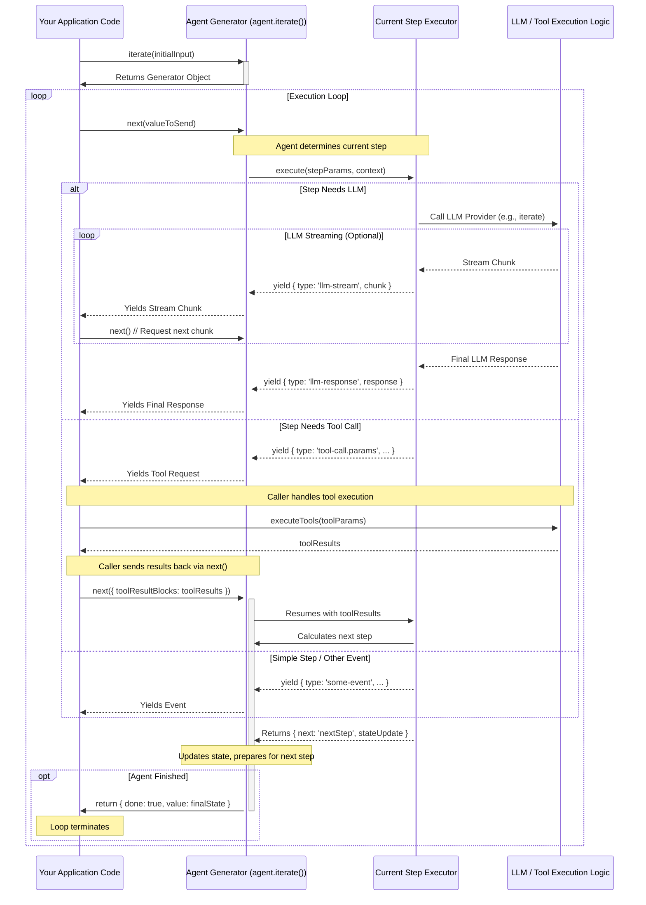

# Core concepts overview

Agenite is designed around a few core concepts that work together to enable the creation of powerful and flexible AI agents. Understanding these concepts is key to effectively using the framework.

<CardGroup cols={2}>
  <Card title="Agents" icon="robot" href="/core-concepts/agents">
    The central orchestrators in Agenite, responsible for managing the flow of execution.
  </Card>
  <Card title="Tools" icon="tool" href="/core-concepts/tools">
    Reusable components that agents can use to perform specific actions or interact with external systems.
  </Card>
  <Card title="LLM" icon="brain" href="/core-concepts/llm">
     Abstraction layer for interacting with different Language Models consistently.
  </Card>
  <Card title="Providers" icon="cloud" href="/core-concepts/providers">
    Connectors to various Large Language Models (LLMs) like OpenAI, Anthropic, etc.
  </Card>
</CardGroup>

Each of these concepts is explored in detail in its dedicated page. What makes Agenite unique, however, is not just these individual components, but how they work together through an innovative architecture based on JavaScript generators.

## Architectural foundation: generators and bidirectional flow

Agenite's core architecture is built upon modern JavaScript features, primarily **Async Generators**. This design choice enables a flexible, controllable, and efficient execution flow for AI agents that is particularly well-suited for:

- Handling asynchronous operations
- Processing streaming data from LLMs
- Supporting complex interactions like Human-in-the-Loop (HITL)
- Providing fine-grained control over agent execution

### How generators power the Agenite experience

At the heart of Agenite, an agent's execution is managed by an Async Generator. When you call the `agent.iterate()` method, it doesn't run the whole process at once but returns an `AsyncGenerator` object that represents the agent's step-by-step execution plan.

```typescript
import { Agent } from '@agenite/agent';
import { BedrockProvider } from '@agenite/bedrock';

const agent = new Agent({ provider: new BedrockProvider() });

// Calling iterate returns the generator, but doesn't run it yet
const generator = agent.iterate({ messages: [{ role: 'user', content: 'Hello!' }] });
```

This generator-based approach provides three key capabilities:

1. **Pausable execution:** Generators can be paused (`yield`) and resumed (`next()`), allowing Agenite to yield control at meaningful points: during LLM calls, tool calls, or while streaming responses.

2. **Step-based progression:** Agenite agents operate in discrete `Steps` (like `agenite.llm-call`, `agenite.tool-call`), with each step's `execute` method often implemented as an `AsyncGenerator`. The main agent generator uses `yield*` to delegate control to the current step's generator.

3. **Bidirectional communication:** The `yield` statement isn't just a pause mechanism—it enables two-way communication between the agent and your application code.

### Bidirectional communication in action

A crucial feature of generators is their bidirectional nature:

- When the generator pauses with `yield`, it sends out a value (like an event describing the current state)
- When your code resumes the generator with `generator.next(value)`, it can pass a value back into the generator

This bidirectional flow enables powerful patterns:

- **Tool execution:** The agent can request a tool to be executed by yielding a tool call event, and your code can send the results back by passing them to `next()`
- **Human input:** The agent can pause to wait for human feedback and continue once it's provided
- **Middleware:** Custom middleware can intercept and transform both the outgoing events and incoming responses

Here's a simple example that demonstrates this bidirectional flow:

```typescript
// A generator that maintains a counter and accepts increment values
async function* interactiveCounter() {
  let count = 0;
  let increment = 1;
  while (true) {
    // Yield the current count and wait for a new increment value
    const newIncrement = yield `Count is ${count}. Send next increment?`;
    
    // Process the value sent back when the generator was resumed
    if (typeof newIncrement === 'number') {
      increment = newIncrement;
    }
    count += increment;
  }
}

// Using the generator
const gen = interactiveCounter();
console.log((await gen.next()).value);  // "Count is 0. Send next increment?"
console.log((await gen.next(5)).value); // "Count is 5. Send next increment?"
console.log((await gen.next(10)).value); // "Count is 15. Send next increment?"
```

In Agenite, this pattern is used extensively to handle tool calls, process LLM streaming responses, and enable human-in-the-loop interactions.

## The agent execution flow

The following sequence diagram illustrates how the different components of Agenite interact during agent execution:



This diagram shows the interplay between:
- Your application code that drives the agent
- The agent generator that orchestrates the execution
- Individual step executors that handle specific tasks
- External systems like LLMs and tools

## Practical examples

### Basic agent execution loop

Here's a practical example of how you might implement a basic execution loop for an Agenite agent:

```typescript
async function runAgent(agent: Agent, initialInput: any) {
  const generator = agent.iterate(initialInput);
  let lastValue: any = undefined; // Value to send back via next()

  while (true) {
    const { value: yieldedEvent, done } = await generator.next(lastValue);

    if (done) {
      console.log('Agent finished. Final State:', yieldedEvent);
      return yieldedEvent;
    }

    // Reset lastValue for the next iteration unless overridden below
    lastValue = undefined;

    // Handle different types of events
    switch (yieldedEvent.type) {
      case 'agenite.llm-call.streaming':
        // Display streaming text from the LLM
        process.stdout.write(yieldedEvent.content?.chunk || '');
        break;

      case 'agenite.tool-call.params':
        // Execute tools and send the results back to the agent
        const toolResults = await executeTools(yieldedEvent.toolUseBlocks);
        lastValue = { toolResultBlocks: toolResults };
        break;

      // Other event types...
    }
  }
}
```

### Human-in-the-loop integration

The generator architecture naturally supports human-in-the-loop scenarios. Here's how you might implement a confirmation step:

```typescript
// 1. Define a custom confirmation step
const requestConfirmationStep = {
  name: 'custom.request-confirmation',
  execute: async function* (params, context) {
    // Yield an event to request confirmation from the human
    const humanResponse = yield {
      type: 'custom.needs-confirmation',
      message: params.messageToConfirm,
    };

    // Continue execution based on the human's response
    if (humanResponse?.confirmed) {
      return { next: params.nextStepOnConfirm };
    } else {
      return { next: params.nextStepOnReject };
    }
  },
};

// 2. Handle the confirmation request in your execution loop
case 'custom.needs-confirmation':
  console.log(`Confirmation Needed: ${yieldedEvent.message}`);
  const confirmed = await promptUserForConfirmation(yieldedEvent.message);
  lastValue = { confirmed };
  break;
```

## Benefits of Agenite's architecture

Agenite's generator-based, bidirectional architecture provides several key advantages:

- **Fine-grained control:** Pause, inspect, and inject data at any point in the execution flow
- **Clear observability:** Monitor the agent's progress through yielded events
- **Natural streaming:** Process streaming data from LLMs in real-time
- **Seamless extensibility:** Add custom middleware or steps without modifying core code
- **Human-in-the-loop capability:** Easily integrate human judgment points into your agent workflows
- **Testability:** Precisely control and test the agent's execution flow

Understanding this architecture is key to unlocking Agenite's full potential for building sophisticated, interactive, and observable AI agents.
