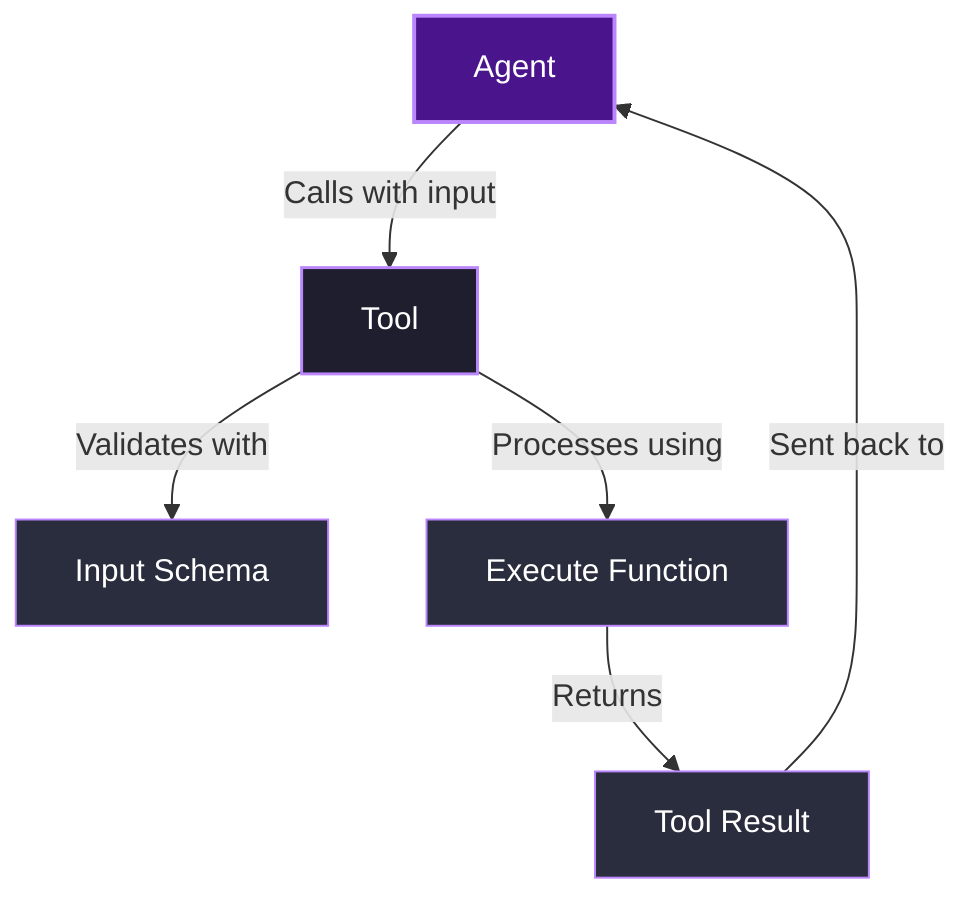

# What are tools?

**Tools** in Agenite are specialized components that extend an agent's capabilities beyond simple text generation. They allow agents to perform specific actions, access external systems, process data, and interact with the real world.

Think of tools as the "hands" of an agent - they enable it to reach out and interact with systems and data outside of its language model, giving it practical abilities to accomplish real tasks.

<Callout type="info">
  **Key aspects of tools**
  
  * **Action-oriented**: Tools perform specific actions like calculations, API calls, or data processing
  * **Schema-defined**: Tools use JSON Schema to validate inputs and ensure proper usage
  * **Error handling**: Tools provide consistent error reporting for reliable agent interactions
  * **Composable**: Multiple tools can be combined to create complex agent capabilities
  * **Type-safe**: Tools are built with TypeScript for type safety and better developer experience
</Callout>

## Tool structure

A tool in Agenite consists of the following key elements:

1. **Name**: A unique identifier for the tool
2. **Description**: Helps the LLM understand when and how to use the tool
3. **Input schema**: Defines the expected structure of inputs using JSON Schema
4. **Execute function**: The actual implementation that performs the tool's function
5. **Version** (optional): For tracking tool versions

### Basic tool architecture



## Creating tools

You can create tools using the `Tool` class from the `@agenite/tool` package. Let's explore some examples:

### Basic calculator tool

Here's a simple calculator tool that performs arithmetic operations:

```typescript
import { Tool } from '@agenite/tool';

interface CalculatorInput {
  operation: 'add' | 'subtract' | 'multiply' | 'divide';
  a: number;
  b: number;
}

const calculatorTool = new Tool<CalculatorInput>({
  name: 'calculator',
  description: 'Perform basic math operations',
  version: '1.0.0',
  inputSchema: {
    type: 'object',
    properties: {
      operation: { 
        type: 'string',
        enum: ['add', 'subtract', 'multiply', 'divide']
      },
      a: { type: 'number' },
      b: { type: 'number' },
    },
    required: ['operation', 'a', 'b'],
  },
  execute: async ({ input }) => {
    const { operation, a, b } = input;
    let result: number;

    switch (operation) {
      case 'add':
        result = a + b;
        break;
      case 'subtract':
        result = a - b;
        break;
      case 'multiply':
        result = a * b;
        break;
      case 'divide':
        if (b === 0) {
          return {
            isError: true,
            data: 'Division by zero',
            error: {
              code: 'DIVISION_BY_ZERO',
              message: 'Cannot divide by zero',
            },
          };
        }
        result = a / b;
        break;
      default:
        return {
          isError: true,
          data: `Unknown operation: ${operation}`,
          error: {
            code: 'INVALID_OPERATION',
            message: `Operation ${operation} not supported`,
          },
        };
    }

    return {
      isError: false,
      data: result.toString(),
    };
  },
});
```

### API integration tool

Tools can also integrate with external APIs. Here's a weather tool example:

```typescript
import { Tool } from '@agenite/tool';

interface WeatherInput {
  city: string;
  units?: 'metric' | 'imperial';
}

// Create a tool factory with API client
export const createWeatherTool = (apiKey: string) => {
  // Simulate a weather API client
  const getWeather = async (city: string, units = 'metric') => {
    // In a real implementation, this would call an actual weather API
    // For example: await fetch(`https://api.weather.com/current?city=${city}&units=${units}&apiKey=${apiKey}`)
    return `Temperature in ${city}: 22°${units === 'metric' ? 'C' : 'F'}`;
  };

  return new Tool<WeatherInput>({
    name: 'weather',
    description: 'Get current weather for a city',
    version: '1.0.0',
    inputSchema: {
      type: 'object',
      properties: {
        city: { type: 'string' },
        units: { 
          type: 'string',
          enum: ['metric', 'imperial'],
          default: 'metric'
        },
      },
      required: ['city'],
    },
    execute: async ({ input }) => {
      try {
        const weather = await getWeather(input.city, input.units);
        return { isError: false, data: weather };
      } catch (error) {
        return {
          isError: true,
          data: `Failed to get weather: ${error}`,
          error: {
            code: 'WEATHER_ERROR',
            message: error instanceof Error ? error.message : String(error),
          },
        };
      }
    },
  });
};
```

## Input validation

Tools validate inputs based on the provided schema, ensuring that they receive the correct data structure before execution. Validation happens automatically before the execute function is called.

### Using JSON Schema

The simplest approach is to define a JSON Schema directly:

```typescript
inputSchema: {
  type: 'object',
  properties: {
    query: { 
      type: 'string',
      description: 'The search query'
    },
    count: { 
      type: 'number',
      description: 'Number of results to return',
      minimum: 1,
      maximum: 10,
      default: 5
    },
  },
  required: ['query'],
}
```

### Using Zod for validation

For more advanced validation, you can use Zod with the `zod-to-json-schema` package:

```typescript
import { z } from 'zod';
import { zodToJsonSchema } from 'zod-to-json-schema';
import { Tool } from '@agenite/tool';

const searchInputSchema = z.object({
  query: z.string().min(3).describe('The search query'),
  count: z.number().min(1).max(10).default(5).describe('Number of results to return'),
});

type SearchInput = z.infer<typeof searchInputSchema>;

const searchTool = new Tool<SearchInput>({
  name: 'search',
  description: 'Search for information on the web',
  inputSchema: searchInputSchema,
  execute: async ({ input }) => {
    // Implementation...
  }
});
```

## Tool response structure

Tool responses follow a consistent format:

```typescript
interface ToolResponse {
  isError: boolean;
  data: string;
  error?: {
    code: string;
    message: string;
    details?: any;
  };
  duration?: number; // Added automatically if not provided
}
```

- **isError**: Indicates whether the tool execution was successful
- **data**: The result as a string (for successful executions) or error message (for failures)
- **error**: Detailed error information when `isError` is true
- **duration**: Execution time in milliseconds (added automatically if not provided)

## Integrating tools with agents

To use tools with an agent, pass them in the `tools` array when creating an agent:

```typescript
import { Agent } from '@agenite/agent';
import { OpenAI } from '@agenite/provider-openai';
import { calculatorTool } from './tools/calculator';
import { createWeatherTool } from './tools/weather';

const weatherTool = createWeatherTool('your-api-key');

const agent = new Agent({
  name: 'helpful-assistant',
  provider: new OpenAI(),
  tools: [calculatorTool, weatherTool],
  instructions: 'You are a helpful assistant. Use the calculator for math operations and the weather tool for weather information.',
});

// Example usage
const result = await agent.execute({
  messages: [
    { role: 'user', content: 'What is 42 * 123 and what\'s the weather in Paris?' }
  ]
});
```

When the agent encounters a task that requires one of these tools, it will:

1. Parse the user's request
2. Identify which tool to use
3. Format the appropriate input
4. Call the tool with that input
5. Process the tool's response
6. Incorporate the result into its final answer

## Best practices for creating tools

1. **Clear descriptions**: Write clear tool descriptions to help the LLM understand when to use them
2. **Robust error handling**: Always handle potential errors and provide meaningful error messages
3. **Input validation**: Use comprehensive schemas to validate inputs and prevent errors
4. **Focused functionality**: Each tool should do one thing well rather than trying to handle multiple functions
5. **Stateless design**: Design tools to be stateless whenever possible for easier debugging and testing
6. **Documentation**: Document expected inputs and outputs, especially any special cases

## Conclusion

Tools are a powerful way to extend an agent's capabilities. By providing specialized functions through tools, you can create agents that can interact with external systems, process data, and perform complex tasks that would be impossible with text generation alone.

In the next section, we'll explore how providers connect agents to different language models.
