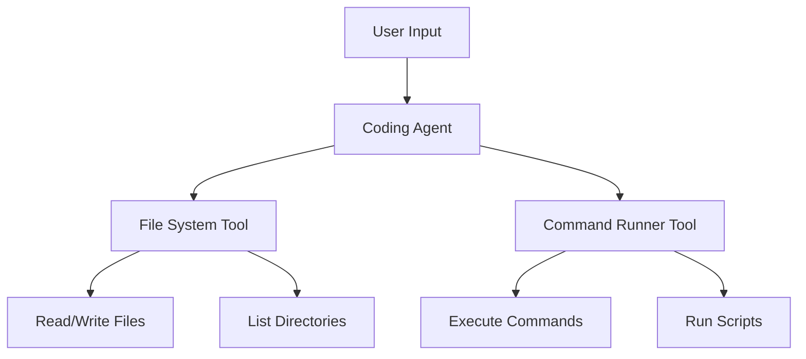
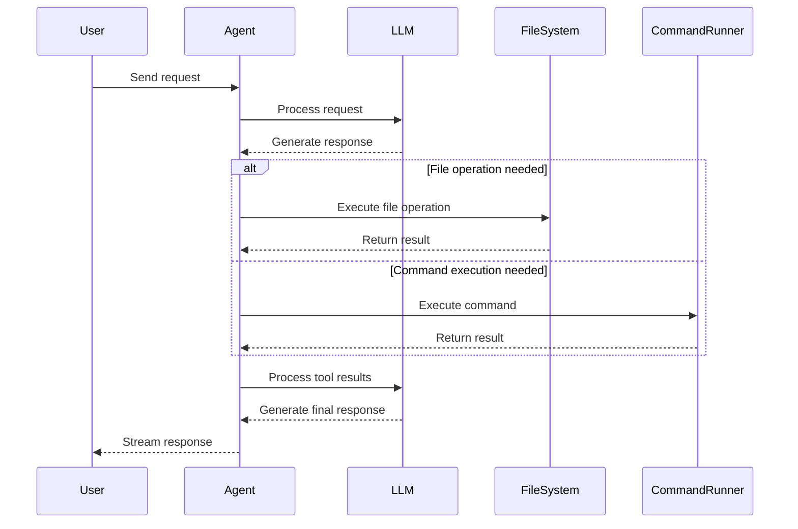

## Overview

In this guide, we'll build a **coding agent** that can help with tasks like reading files, running commands, and making code modifications. We'll use Agenite's powerful tools and streaming capabilities to create an interactive experience.

View the full example at [GitHub](https://github.com/subeshb1/agenite/tree/main/examples/coding-agent).

The following diagrams illustrate the architecture and interaction flow of our coding agent:



This flow chart shows the high-level architecture of our coding agent. The agent receives user input and delegates tasks to specialized tools - the file system tool for file operations and the command runner for executing system commands.



This sequence diagram illustrates the interaction flow between components. It shows how the agent processes user requests, coordinates with the LLM for decision-making, executes tools as needed, and streams responses back to the user.

## Required tools

Our coding agent needs two main tools:

<AccordionGroup>
  <Accordion title="File system tool">
    Handles file operations like:
    - Reading file contents
    - Writing/modifying files
    - Listing directory contents
    - Creating directories
  </Accordion>

  <Accordion title="Command runner tool">
    Manages system commands:
    - Executing shell commands
    - Running scripts
    - Managing command timeouts
    - Caching command results
  </Accordion>
</AccordionGroup>

## Installation


<CodeGroup>

```bash npm
npm install @agenite/agent @agenite/tool @agenite/bedrock @agenite/ollama
```

```bash pnpm
pnpm add @agenite/agent @agenite/tool @agenite/bedrock @agenite/ollama    
```

```bash yarn
yarn add @agenite/agent @agenite/tool @agenite/bedrock @agenite/ollama
```

</CodeGroup>

## Creating the tools

Let's implement our tools with proper error handling and type safety:

<CodeGroup>
```typescript File system tool
import { Tool } from '@agenite/tool';
import * as fs from 'fs/promises';
import * as path from 'path';

export function createFileSystemTool() {
  return new Tool({
    name: 'file-system',
    description: 'Perform file system operations',
    inputSchema: {
      type: 'object',
      properties: {
        operation: {
          type: 'string',
          enum: ['read', 'write', 'list', 'exists', 'mkdir'],
        },
        path: { type: 'string' },
        content: { type: 'string' },
      },
      required: ['operation', 'path'],
    },
    execute: async ({ input }) => {
      const startTime = Date.now();
      const fullPath = path.resolve(input.path);

      try {
        switch (input.operation) {
          case 'read': {
            const content = await fs.readFile(fullPath, 'utf-8');
            return {
              isError: false,
              data: content,
              duration: Date.now() - startTime,
            };
          }
          case 'write': {
            await fs.mkdir(path.dirname(fullPath), { recursive: true });
            await fs.writeFile(fullPath, input.content || '');
            return {
              isError: false,
              data: `File written to ${input.path}`,
              duration: Date.now() - startTime,
            };
          }
          // ... other operations
        }
      } catch (error) {
        return {
          isError: true,
          data: error.message,
          duration: Date.now() - startTime,
        };
      }
    },
  });
}
```

```typescript Command runner tool
import { Tool } from '@agenite/tool';
import { spawn } from 'child_process';

export function createCommandRunnerTool() {
  return new Tool({
    name: 'command_runner',
    description: 'Executes shell commands safely with timeout and caching',
    inputSchema: {
      type: 'object',
      properties: {
        command: {
          type: 'string',
          description: 'The command to execute',
        },
        cwd: {
          type: 'string',
          description: 'Working directory for the command',
        },
        timeout: {
          type: 'number',
          description: 'Command timeout in milliseconds',
        },
      },
      required: ['command'],
    },
    execute: async ({ input }) => {
      const startTime = Date.now();
      
      return new Promise((resolve) => {
        let output = '';
        let errorOutput = '';

        const [cmd, ...args] = input.command.split(' ');
        const child = spawn(cmd, args, {
          cwd: input.cwd || process.cwd(),
          shell: true,
        });

        const timeout = input.timeout || 30000;
        const timer = setTimeout(() => {
          child.kill('SIGTERM');
          resolve({
            isError: true,
            data: 'Command timed out',
            duration: Date.now() - startTime,
          });
        }, timeout);

        child.stdout.on('data', (data) => {
          output += data.toString();
        });

        child.stderr.on('data', (data) => {
          errorOutput += data.toString();
        });

        child.on('close', (code) => {
          clearTimeout(timer);
          resolve({
            isError: code !== 0,
            data: output || errorOutput || 'No output',
            duration: Date.now() - startTime,
          });
        });
      });
    },
  });
}
```
</CodeGroup>

## Building the agent

Now let's create our coding agent. You can use different providers based on your needs:

<CodeGroup>

```typescript AWS Bedrock
import { Agent } from '@agenite/agent';
import { BedrockProvider } from '@agenite/bedrock';
import { createFileSystemTool } from './tools/file-system';
import { createCommandRunnerTool } from './tools/command-runner';

// Configure AWS Bedrock provider
const provider = new BedrockProvider({
  region: 'us-west-2',
  model: 'anthropic.claude-3-sonnet-20240229-v1:0',
});

const agent = new Agent({
  name: 'CodingAgent',
  description: 'An AI agent specialized in coding tasks',
  provider,
  instructions: 'You are an expert coding assistant. Help users with reading files, running commands, and making code modifications.',
  tools: [createFileSystemTool(), createCommandRunnerTool()],
});
```

```typescript Ollama
import { Agent } from '@agenite/agent';
import { OllamaProvider } from '@agenite/ollama';
import { createFileSystemTool } from './tools/file-system';
import { createCommandRunnerTool } from './tools/command-runner';

// Configure Ollama provider for local deployment
const provider = new OllamaProvider({
  model: 'codellama',
});

const agent = new Agent({
  name: 'CodingAgent',
  description: 'An AI agent specialized in coding tasks',
  provider,
  instructions: 'You are an expert coding assistant. Help users with reading files, running commands, and making code modifications.',
  tools: [createFileSystemTool(), createCommandRunnerTool()],
});
```

</CodeGroup>

<Note>
For AWS Bedrock, ensure you have AWS credentials configured. For Ollama, make sure you have it [installed and running locally](https://ollama.ai).
</Note>

## Using the agent

Let's see how to use our coding agent in streaming and execute modes:

<CodeGroup>
```typescript Streaming mode
import { userTextMessage } from '@agenite/agent';

// Interactive streaming mode
const iterator = agent.iterate({
  messages: [userTextMessage('Analyze the code in src/App.tsx')],
});

// Process the stream
for await (const chunk of iterator) {
  switch (chunk.type) {
    case 'agenite.llm-call.streaming':
      if (chunk.content.type === 'text') {
        process.stdout.write(chunk.content.text);
      } else if (chunk.content.type === 'toolUse') {
        console.log('Using tool:', chunk.content.toolUse);
      }
      break;
    case 'agenite.tool-result':
      console.log('Tool result:', chunk.result);
      break;
  }
}
```

```typescript Execute mode
import { userTextMessage } from '@agenite/agent';

// Simple execution mode
const response = await agent.execute({
  messages: [userTextMessage('Analyze the code in src/App.tsx')],
});

console.log('Agent response:', response);
```
</CodeGroup>

## Conclusion

In this guide, we built a powerful coding agent that can:
- Read and analyze code files
- Execute system commands safely
- Make code modifications
- Provide real-time feedback through streaming

The agent's modular architecture and type-safe tools make it easy to extend and customize for your specific needs. Check out the [full example on GitHub](https://github.com/subeshb1/agenite/tree/main/examples/coding-agent) to explore more features and capabilities.
