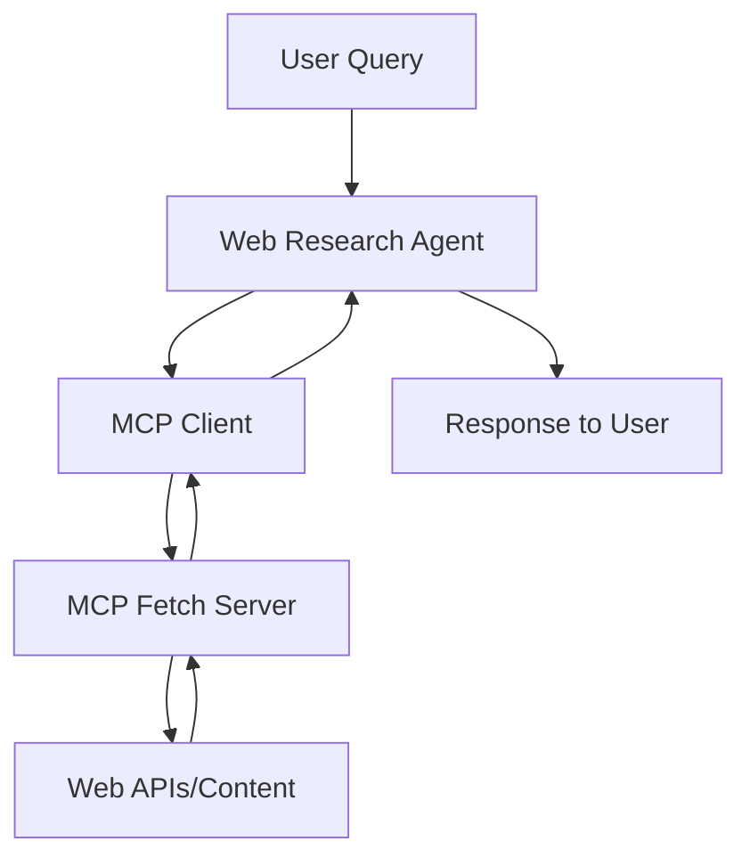

## Overview

In this guide, we'll build a **web research agent** that can search and fetch information from the web using the Model Context Protocol (MCP). Web research agents are perfect for gathering real-time information from websites, answering queries based on web content, and creating summaries of online resources.

The following diagram illustrates the architecture of our web research agent:



## What is MCP?

[Model Context Protocol (MCP)](https://modelcontextprotocol.io/introduction) is an open protocol that standardizes how applications provide context to LLMs. Think of MCP like a USB-C port for AI applications - it provides a standardized way to connect AI models to different data sources and tools.

The key benefits of using MCP for our web research agent:

- Seamless integration with web data sources
- Standardized interface for fetching content 
- Separation of concerns between the agent and the data fetching logic
- Ability to switch between different data sources without changing the agent code

## Prerequisites

Before building the web research agent, you'll need:

1. Node.js installed on your system
2. Basic understanding of TypeScript and Agenite
3. An API key for your preferred LLM provider (OpenAI, Anthropic, or others)

## Installation

First, install the required packages:

<CodeGroup>

```bash npm
npm install @agenite/agent @agenite/mcp @agenite/ollama
```

```bash pnpm
pnpm add @agenite/agent @agenite/mcp @agenite/ollama
```

```bash yarn
yarn add @agenite/agent @agenite/mcp @agenite/ollama
```

</CodeGroup>

## Setting up the MCP client

The first step is to create an MCP client that will connect to the MCP fetch server:

```typescript
import { MCPClient } from '@agenite/mcp';

// Initialize MCP client with fetch server
const mcpClient = new MCPClient({
  name: 'web-research-agent',
  mcpServers: {
    // Option 1: Using the hosted MCP fetch server via SSE
    fetch: {
      url: 'https://router.mcp.so/sse/rrrcnqm8s6mf5l',
    },
    
    // Option 2: Running a local fetch server via stdio
    // fetch: {
    //   command: 'npx',
    //   args: ['-y', '@modelcontextprotocol/server-fetch'],
    // }
  },
});

// Get all tools from the MCP servers
const tools = await mcpClient.getAllTools();

console.log(`Found ${tools.length} tools from MCP servers`);
```

## Creating the web research agent

Now let's build the agent that will use the MCP tools:

```typescript
import { Agent } from '@agenite/agent';
import { OllamaProvider } from '@agenite/ollama';
import { prettyLogger } from '@agenite/pretty-logger';

// Create the agent with MCP tools
const agent = new Agent({
  name: 'web-research-agent',
  provider: new OllamaProvider({
    model: 'llama3.2',
    baseURL: 'http://localhost:11434', // Update with your Ollama endpoint
  }),
  tools: tools, // MCP tools we obtained earlier
  instructions: `
    You are a web research assistant that can search and retrieve information from the web.
    When asked about current events, facts, or online content, use the fetch tools to get accurate information.
    Always cite your sources by providing the URLs you retrieved information from.
    For complex queries, break down your research into multiple steps and explain your approach.
  `,
  middlewares: [prettyLogger()],
});
```

## Using the web research agent

Let's use our agent to answer a research question:

```typescript
// Example research question
const result = await agent.execute({
  messages: [
    {
      role: 'user',
      content: [
        { 
          type: 'text', 
          text: 'What is Agenite and what are its main features? Please research and provide a summary.' 
        },
      ],
    },
  ],
});

// Print the result
if (result.messages.length > 0) {
  const lastMessage = result.messages[result.messages.length - 1];
  if (lastMessage) {
    console.log('Research results:', lastMessage.content);
  }
}
```

## Complete example

Here's the complete example for a web research agent using MCP:

```typescript
import { Agent } from '@agenite/agent';
import { OllamaProvider } from '@agenite/ollama';
import { MCPClient } from '@agenite/mcp';
import { prettyLogger } from '@agenite/pretty-logger';

async function main() {
  // Initialize MCP client
  const mcpClient = new MCPClient({
    name: 'web-research-agent',
    mcpServers: {
      fetch: {
        url: 'https://router.mcp.so/sse/rrrcnqm8s6mf5l',
      },
    },
  });

  try {
    // Get all tools from MCP servers
    console.log('Fetching tools from MCP servers...');
    const tools = await mcpClient.getAllTools();
    console.log(`Found ${tools.length} tools`);

    // Create the agent
    const agent = new Agent({
      name: 'web-research-agent',
      provider: new OllamaProvider({
        model: 'llama3.2',
        baseURL: 'http://localhost:11434',
      }),
      tools: tools,
      instructions: `
        You are a web research assistant that can search and retrieve information from the web.
        When asked about current events, facts, or online content, use the fetch tools to get accurate information.
        Always cite your sources by providing the URLs you retrieved information from.
        For complex queries, break down your research into multiple steps and explain your approach.
      `,
      middlewares: [prettyLogger()],
    });

    // Example research question
    const result = await agent.execute({
      messages: [
        {
          role: 'user',
          content: [
            { 
              type: 'text', 
              text: 'What is Agenite and what are its main features? Please research and provide a summary.' 
            },
          ],
        },
      ],
    });

    // Print the result
    if (result.messages.length > 0) {
      const lastMessage = result.messages[result.messages.length - 1];
      if (lastMessage) {
        console.log('Research results:', lastMessage.content);
      }
    }
  } catch (error) {
    console.error('Error during research:', error);
  }
}

main().catch((error) => {
  console.error('Error:', error);
  process.exit(1);
});
```

## Advanced usage: streaming responses

For a more interactive experience, you can use Agenite's streaming capabilities:

```typescript
// Create an iterator for streaming responses
const iterator = agent.iterate({
  messages: [
    {
      role: 'user',
      content: [
        { 
          type: 'text', 
          text: 'What are the latest developments in artificial intelligence?' 
        },
      ],
    },
  ],
});

// Process streaming responses
for await (const chunk of iterator) {
  // Handle different types of chunks (message, tool calls, etc.)
  if (chunk.type === 'message') {
    process.stdout.write(chunk.content || '');
  } else if (chunk.type === 'tool_call') {
    console.log(`\n[Using tool: ${chunk.name}]`);
  } else if (chunk.type === 'tool_result') {
    console.log(`\n[Tool result received]`);
  }
}
```

## Conclusion

In this guide, we've built a web research agent using Agenite's MCP integration. This agent can:

- Connect to MCP servers to access web data
- Search and retrieve information from websites
- Process and summarize web content
- Provide cited responses to research queries

The Model Context Protocol provides a standardized way to connect our agent to web data sources, making it easy to build powerful web research capabilities without having to implement complex web scraping or API integration logic.

For more advanced usage and a deeper understanding of MCP, check out the [MCP package documentation](/packages/mcp).

View the full example on [GitHub](https://github.com/subeshb1/agenite/tree/main/examples/@agenite/mcp). 
