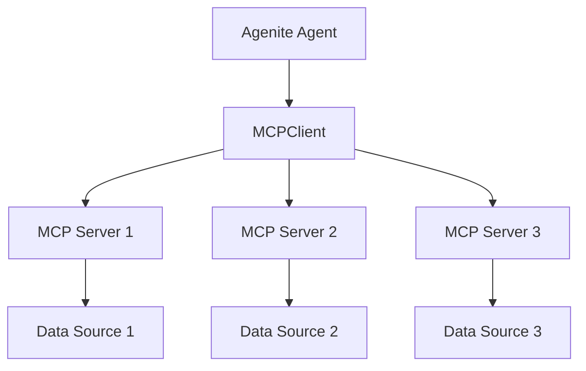

The `@agenite/mcp` package provides a client implementation for interacting with [Model Context Protocol (MCP)](https://modelcontextprotocol.io/introduction) servers. This enables Agenite agents to seamlessly access external data sources and capabilities through a standardized protocol.

## What is MCP?

MCP (Model Context Protocol) is an open protocol that standardizes how applications provide context to large language models (LLMs). It creates a consistent way for LLMs to access data from various sources, similar to how USB-C provides a universal connection for hardware.

Key benefits of MCP include:

- **Standardized integration**: Connect to any MCP-compliant server using the same code
- **Data security**: Keep sensitive data within your infrastructure
- **Flexibility**: Switch between different data sources or LLM providers
- **Extensibility**: Use pre-built MCP servers or create your own

## Installation

```bash
npm install @agenite/mcp
```

## Basic usage

To use the MCP client with Agenite agents:

```typescript
import { MCPClient } from '@agenite/mcp';
import { Agent } from '@agenite/agent';
import { OllamaProvider } from '@agenite/ollama';

// Create an MCPClient with server configurations
const mcpClient = new MCPClient({
  name: 'my-client',
  mcpServers: {
    // Connect to a server using SSE transport
    fetch: {
      url: 'https://router.mcp.so/sse/your-server-id',
    },
    
    // Connect to a filesystem server using stdio transport
    filesystem: {
      command: 'npx',
      args: [
        '-y',
        '@modelcontextprotocol/server-filesystem',
        '/path/to/allowed/dir',
      ],
    }
  }
});

// Get all tools from all servers
const tools = await mcpClient.getAllTools();

// Create an agent with the MCP tools
const agent = new Agent({
  name: 'mcp-enabled-agent',
  provider: new OllamaProvider({
    model: 'llama3.2',
    baseURL: 'http://localhost:11434',
  }),
  tools: tools,
  // ...other agent configuration
});

// Use the agent with MCP tools
const result = await agent.execute({
  messages: [
    {
      role: 'user',
      content: [
        { type: 'text', text: 'What is the latest news about AI?' },
      ],
    },
  ],
});
```

## Connection types

The `@agenite/mcp` package supports two transport mechanisms for connecting to MCP servers:

### SSE transport

Server-sent events (SSE) transport allows connecting to remote MCP servers over HTTP:

```typescript
const mcpClient = new MCPClient({
  name: 'sse-client',
  mcpServers: {
    fetch: {
      url: 'https://router.mcp.so/sse/your-server-id',
    }
  }
});
```

### Stdio transport

Standard I/O transport allows running MCP servers as local processes:

```typescript
const mcpClient = new MCPClient({
  name: 'stdio-client',
  mcpServers: {
    filesystem: {
      command: 'npx',
      args: ['-y', '@modelcontextprotocol/server-filesystem', './data'],
      env: { NODE_ENV: 'production' },
      cwd: '/path/to/working/directory'
    }
  }
});
```

## API reference

### MCPClient

The main class for interacting with MCP servers.

#### Constructor

```typescript
const client = new MCPClient({
  name: string;          // A name for the client (used in MCP protocol)
  version?: string;      // Optional version (defaults to '1.0.0')
  mcpServers: {          // Configuration for MCP servers
    [name: string]: MCPServerConfig;
  }
});
```

#### MCPServerConfig

There are two types of server configurations:

```typescript
// SSE transport configuration
interface MCPSSEConfig {
  url: string;  // URL for the SSE endpoint
}

// Stdio transport configuration
interface MCPStdioConfig {
  command: string;     // Command to run the server
  args?: string[];     // Arguments for the command
  env?: Record<string, string>; // Optional environment variables
  cwd?: string;        // Working directory for the command
}
```

#### Methods

```typescript
// Get tools from a specific server
const tools = await client.getTools(serverName: string): Promise<Tool[]>

// Get all tools from all servers as a flat array
const allTools = await client.getAllTools(): Promise<Tool[]>

// Get all tools organized by server
const toolsByServer = await client.getAllToolsByServer(): Promise<{[serverName: string]: Tool[]}>

// Get configured server names
const serverNames = client.getServerNames(): string[]
```

### Tool integration

Tools returned by the MCPClient are standard `@agenite/tool` instances that can be used directly with Agenite agents:

```typescript
// Get all tools
const tools = await mcpClient.getAllTools();

// Each tool is an @agenite/tool instance
tools.forEach(tool => {
  console.log(`- ${tool.name}: ${tool.description}`);
});

// Use tools in an agent
const agent = new Agent({
  // ...
  tools: tools,
});
```

## Common MCP servers

The MCP ecosystem includes several pre-built servers:

| Server | Description | NPM Package |
|--------|-------------|------------|
| Fetch | Makes HTTP requests to fetch web content | `@modelcontextprotocol/server-fetch` |
| Filesystem | Provides access to local files | `@modelcontextprotocol/server-filesystem` |
| Sqlite | Connects to SQLite databases | `@modelcontextprotocol/server-sqlite` |
| Weather | Fetches weather data | `@modelcontextprotocol/server-weather` |

## Example: using multiple MCP servers

This example connects to both the fetch and filesystem MCP servers:

```typescript
import { MCPClient } from '@agenite/mcp';
import { Agent } from '@agenite/agent';
import { OllamaProvider } from '@agenite/ollama';

// Create client with multiple servers
const mcpClient = new MCPClient({
  name: 'multi-client',
  mcpServers: {
    // Web content fetching
    fetch: {
      url: 'https://router.mcp.so/sse/rrrcnqm8s6mf5l',
    },
    
    // Local filesystem access
    filesystem: {
      command: 'npx',
      args: ['-y', '@modelcontextprotocol/server-filesystem', './data'],
    }
  }
});

// Get all tools from all servers
const tools = await mcpClient.getAllTools();

// Create an agent with the tools
const agent = new Agent({
  name: 'multi-mcp-agent',
  provider: new OllamaProvider({
    model: 'llama3.2',
    baseURL: 'http://localhost:11434',
  }),
  tools: tools,
  instructions: `
    You are an assistant that can both search the web and access local files.
    Use the fetch tools to get information from the internet.
    Use the filesystem tools to read and write files in the allowed directory.
  `,
});

// Use the agent
const result = await agent.execute({
  messages: [
    {
      role: 'user',
      content: [
        { 
          type: 'text', 
          text: 'Find information about TypeScript on the web and save it to a file called typescript-info.txt' 
        },
      ],
    },
  ],
});
```

## Understanding tool namespacing

When you get tools from multiple MCP servers, the MCPClient prefixes each tool name with the server name to avoid name collisions:

```typescript
// Server: fetch, Tool: get_url
// In your agent, the tool name will be: fetch.get_url

// Server: filesystem, Tool: read_file
// In your agent, the tool name will be: filesystem.read_file
```

You can see the tool namespacing by inspecting the tools:

```typescript
const toolsByServer = await mcpClient.getAllToolsByServer();

// Log tools by server
for (const [serverName, serverTools] of Object.entries(toolsByServer)) {
  console.log(`\n${serverName} tools:`);
  serverTools.forEach(tool => {
    console.log(`  - ${tool.name}`); // Will include server prefix
  });
}
```

## Advanced usage: getting tools by server

If you need to organize or filter tools by server:

```typescript
// Get tools by server
const toolsByServer = await mcpClient.getAllToolsByServer();

// Get only tools from the fetch server
const fetchTools = toolsByServer['fetch'] || [];

// Get only tools from the filesystem server
const filesystemTools = toolsByServer['filesystem'] || [];

// Create specialized agents for different purposes
const webResearchAgent = new Agent({
  name: 'web-researcher',
  tools: fetchTools,
  // ...
});

const fileManagementAgent = new Agent({
  name: 'file-manager',
  tools: filesystemTools,
  // ...
});
```

## Running your own MCP servers

You can run your own MCP servers for custom integrations:

```bash
# Install an MCP server
npm install -g @modelcontextprotocol/server-filesystem

# Run the server (typically done from your application)
mcp-server-filesystem /path/to/directory
```

For custom servers, see the [MCP documentation](https://modelcontextprotocol.io/) on building servers.

## MCP architecture

The MCP architecture follows a client-server model:



1. **MCPClient**: Connects to one or more MCP servers
2. **MCP Servers**: Provide tools that access specific data sources
3. **Tools**: Exposed by servers and used by agents to perform actions
4. **Data Sources**: Systems that provide data or functionality to the agent

## Conclusion

The `@agenite/mcp` package provides a powerful way to integrate external data sources and capabilities into your Agenite agents. By leveraging the standardized Model Context Protocol, you can create agents that interact with a wide range of systems without having to implement complex integrations for each one.

To explore more advanced MCP scenarios, check out the [building a web research agent](/deep-dive-building-web-research-agent) guide and the [example code](https://github.com/subeshb1/agenite/tree/main/examples/@agenite/mcp) on GitHub.
